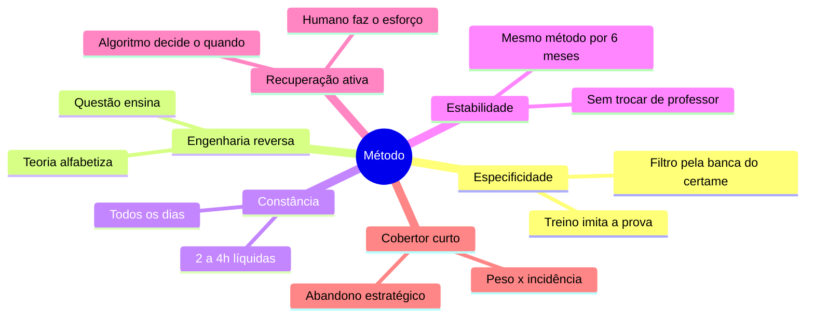
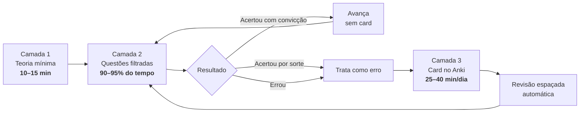
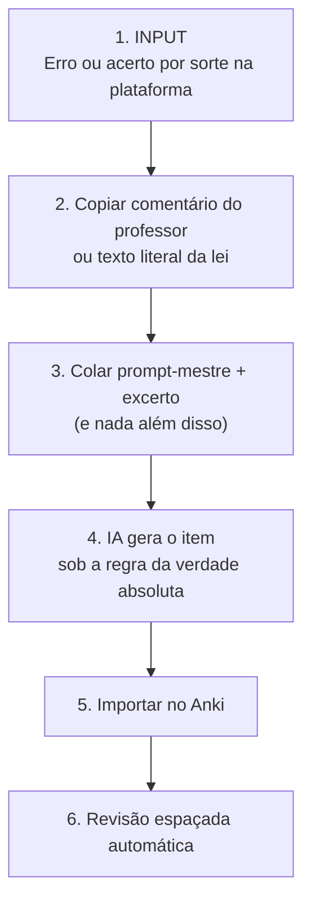

<div align="center">

# Engenharia reversa da banca

**O método de estudo por questões de Valter Rodrigues — sistematizado, passo a passo, para qualquer área de concurso.**

*Estudo metodológico · Preparação para concursos públicos*

[](https://www.youtube.com/@ValterRodrigues01)
[](https://www.youtube.com/@ValterRodrigues01)
[](#2-corpus-e-método-desta-sistematização)
[](LICENSE)

</div>

---

> [!IMPORTANT]
> **Crédito.** O método descrito neste repositório é **integralmente de autoria de [Valter Rodrigues](https://www.youtube.com/@ValterRodrigues01)** — policial civil, bacharel em Direito, 1.º colocado no concurso da Polícia Civil de Pernambuco.
> Este repositório é uma **sistematização independente**, feita a partir de conteúdo público do canal, **sem vínculo, patrocínio, revisão ou endosso do autor**. Não há transcrição integral de vídeo aqui: o texto é descritivo e analítico, e remete o leitor à fonte original em [todas as referências](#referências--fontes-do-corpus).
> Se você chegou até aqui, **assista aos vídeos no canal**. É de lá que vem o método.

---

## Resumo

Este trabalho reconstrói, a partir de um corpus de 60 vídeos e materiais de apoio, o protocolo de estudo defendido por Valter Rodrigues para provas objetivas de concurso público.

O método rejeita o eixo tradicional *videoaula → resumo → revisão programada* e o substitui por um ciclo de três camadas: contato teórico mínimo (10–15 min), resolução massiva de questões filtradas pela banca do certame, e conversão dos erros em cartões de repetição espaçada.

O documento descreve o protocolo operacional passo a passo, a arquitetura de cadernos e filtros na plataforma de questões, o uso da estatística e do ranking de dificuldade, o desenho do cronograma em ciclo duplo, os parâmetros de configuração do Anki e o fluxo de uso de inteligência artificial ensinado nas duas aulas específicas sobre o tema. Encerra com um mapa de transposição do método para carreiras fora da área policial, um catálogo de antipadrões e uma seção de limitações.

**Palavras-chave:** estudo por questões · engenharia reversa de banca · prática de recuperação · repetição espaçada · princípio da especificidade · Anki · FSRS · ciclo de estudos · revisão ativa.

---

## Sumário

| # | Seção | O que resolve |
|---|---|---|
| 1 | [Introdução: o problema do estudo passivo](#1-introdução-o-problema-do-estudo-passivo) | Por que o eixo tradicional falha |
| 2 | [Corpus e método desta sistematização](#2-corpus-e-método-desta-sistematização) | De onde vem cada afirmação |
| 3 | [O autor do método](#3-o-autor-do-método) | Quem é e por que a credibilidade importa |
| 4 | [Fundamentos: os seis princípios](#4-fundamentos-os-seis-princípios) | A lógica por trás de cada regra prática |
| 5 | [O protocolo em três camadas](#5-o-protocolo-em-três-camadas) | O que fazer amanhã de manhã |
| 6 | [Arquitetura de cadernos e filtros](#6-arquitetura-de-cadernos-e-filtros) | Como montar o material de treino |
| 7 | [Ranking, estatística e como configurá-los](#7-ranking-estatística-e-como-configurá-los) | Como decidir o que estudar com dados |
| 8 | [Cronograma: o ciclo duplo](#8-cronograma-o-ciclo-duplo) | Como distribuir o tempo |
| 9 | [A camada de revisão: Anki](#9-a-camada-de-revisão-anki) | Como não esquecer o que já custou caro |
| 10 | [Inteligência artificial aplicada](#10-inteligência-artificial-aplicada-ao-método) | O fluxo das Aulas 01 e 02 |
| 11 | [Transposição para outras áreas](#11-transposição-para-outras-áreas) | Policial, fiscal, tribunais, nível médio |
| 12 | [Catálogo de antipadrões](#12-catálogo-de-antipadrões) | O que sabota a preparação |
| 13 | [Limitações e ressalvas](#13-limitações-e-ressalvas) | Onde o método não alcança |
| 14 | [Conclusão](#14-conclusão) | — |
| — | [Referências](#referências--fontes-do-corpus) | Todos os vídeos, com link |

---

## 1. Introdução: o problema do estudo passivo

O candidato médio organiza a preparação em torno de um pressuposto raramente examinado: o de que **primeiro se aprende a matéria e só depois se treina a prova**. Desse pressuposto derivam a videoaula integral, o PDF de trezentas páginas, o resumo manuscrito colorido e o calendário de revisões em 24 horas, 7 dias e 30 dias.

O método aqui descrito parte da negação desse pressuposto. A prova objetiva não mede o domínio acadêmico de uma disciplina; mede a capacidade de **julgar corretamente um enunciado escrito por uma banca específica**, dentro de um recorte estreito de assuntos, sob pressão de tempo. Se é isso que a prova mede, é isso que o treino precisa reproduzir — e o resto é custo de oportunidade.

> [!NOTE]
> **A tese central, em uma frase:**
> A aprovação não vem de aprofundamento acadêmico, mas de um processo ativo de **engenharia reversa da banca** somado a **memorização espaçada e automatizada**.

Tudo o que se segue é a operacionalização dessa frase.

---

## 2. Corpus e método desta sistematização

O material analisado corresponde a um caderno de pesquisa com **63 fontes**: 60 vídeos publicados no canal de Valter Rodrigues (aproximadamente entre 2023 e 2026) e três materiais de apoio (um documento de priorização por edital e dois arquivos de prompt).

Os vídeos foram interrogados de forma temática, em nove blocos de perguntas:

1. Identidade do autor e princípios do método
2. Protocolo de resolução de questões
3. Montagem de cadernos e filtros
4. Estatística, ranking e incidência
5. Uso do Anki
6. As duas aulas sobre inteligência artificial
7. Cronograma e carga horária
8. Erros comuns e adaptação por área
9. Estrutura do prompt de geração de questões

As respostas foram cruzadas entre si e reorganizadas na estrutura deste documento. Quando o corpus fornece números explícitos, eles aparecem no texto; quando um número resulta de inferência ou síntese, isso está sinalizado. A [Seção 13](#13-limitações-e-ressalvas) discute as limitações desse desenho.

---

## 3. O autor do método

Valter Rodrigues é policial civil e bacharel em Direito. Sua credibilidade dentro do próprio corpus não vem de um discurso de sucesso linear, mas do contrário: ele apresenta aprovações e derrotas com o mesmo grau de detalhe.

| Certame | Resultado |
|---|---|
| Polícia Civil de Pernambuco | **1.º colocado** |
| Delegado — Polícia Civil de Alagoas | Fora da aprovação **por 1 ponto** |
| Polícia Civil de Goiás | Desclassificado (celular tocou dentro da sala) |
| Polícia Penal-DF | Estratégia documentada publicamente como inscrito |

O tom do canal é deliberadamente antirromântico. Ele rejeita a estética do sofrimento — a rotina de quatro horas de sono, o banho gelado de madrugada, o marketing motivacional de cursinho — e trata o concurso como um problema de engenharia com restrição de recursos.

Isso importa metodologicamente: **quase toda recomendação do método é justificada por custo-benefício, não por virtude.**

> *"Do concurso da guarda municipal ao topo da magistratura, a prova objetiva continua sendo o mesmo teste mecânico. A metodologia não pode mudar; muda só o volume de dados."*

---

## 4. Fundamentos: os seis princípios



### 4.1 Princípio da especificidade

É o eixo do método, tomado por empréstimo da fisiologia do treinamento esportivo: **o treino deve mimetizar as condições reais da competição**. Nadador treina nadando; goleiro treina defendendo. O concurseiro treina *marcando gabarito de questões da banca do seu concurso*.

Ler doutrina tem especificidade baixíssima. Resolver questão da banca tem especificidade máxima. Esse princípio é o que, mais adiante, justifica **cada filtro** aplicado na plataforma de questões.

### 4.2 Engenharia reversa

A teoria não é o ponto de partida do aprendizado, e sim uma ferramenta de alfabetização mínima: serve para o candidato adquirir o "idioma" da disciplina. Depois disso, aprende-se **a partir** da questão, e não antes dela. O enunciado, o gabarito e o comentário do professor formam a unidade elementar de estudo.

### 4.3 Constância acima de intensidade

De **2 a 4 horas líquidas por dia, todos os dias do ano**, superam picos insustentáveis seguidos de colapso. O argumento é de sustentabilidade, não de moral: a intensidade cognitiva real de resolver questões concentrado é alta o bastante para tornar dez horas diárias uma ficção estatística — quem afirma esse número normalmente está contabilizando tempo passivo.

### 4.4 Estabilidade metodológica

Trocar de método, professor ou cronograma a cada oscilação de rendimento destrói a curva de adaptação. O corpus recomenda manter o mesmo protocolo por **no mínimo seis meses** antes de julgá-lo — tempo necessário tanto para a adaptação cognitiva quanto para que as estatísticas pessoais tenham amostra suficiente para significar alguma coisa.

### 4.5 Recuperação ativa automatizada

Calendários fixos de revisão (24 h / 7 dias / 30 dias) são tratados como desperdício: revisam o que já está consolidado na mesma frequência com que revisam o que está frágil. O método transfere a decisão de **quando** revisar para o algoritmo de repetição espaçada, e o esforço humano para o **ato** de recuperar a informação.

### 4.6 Cobertor curto

O tempo é finito e o edital não é. Em vez de cobertura homogênea, o método impõe alocação proporcional ao retorno: **peso da matéria na prova × incidência histórica do assunto na banca**. O abandono estratégico de tópicos de baixíssima incidência não é preguiça — é a única forma de financiar profundidade onde os pontos realmente estão.

---

## 5. O protocolo em três camadas

A camada 1 alfabetiza, a camada 2 diagnostica, a camada 3 repara.



| Camada | Função | Tempo | Saída |
|---|---|---|---|
| **1. Contato teórico** | Alfabetizar no vocabulário do assunto | 10–15 min por assunto | Familiaridade mínima com os termos |
| **2. Questões** | Diagnosticar lacunas e aprender o padrão da banca | 90–95% do tempo líquido | Lista de erros e acertos por sorte |
| **3. Anki** | Reparar as lacunas e impedir o esquecimento | 25–40 min fragmentados | Retenção de longo prazo |

### 5.1 Camada 1 — o primeiro contato com um assunto novo

Leitura de um resumo objetivo, sinopse ou mapa mental por, **no máximo, 10 a 15 minutos**. É explicitamente vedado, nesta fase, assistir a videoaulas longas ou ler PDFs teóricos extensos.

O objetivo não é compreender o tema em profundidade: é **saber o que significam as palavras que aparecerão nos enunciados**.

### 5.2 Camada 2 — a resolução

Encerrados os 15 minutos, vai-se imediatamente para um bloco de **20 a 30 questões** do assunto específico.

Para o iniciante absoluto, o bloco deve ser filtrado apenas nas questões classificadas como **muito fáceis** pela base — aquelas com 85% a 90% de acerto geral entre os usuários. A razão é comportamental antes de ser pedagógica: *um iniciante que erra 80% do primeiro bloco abandona o método.*

1. **Leia e decida rápido.** De 1 a 2 minutos por questão, no máximo.
2. **Não brigue com a questão.** Se não sabe, não fique sofrendo nem chutando às cegas: abra o gabarito e o comentário do professor. No treino por engenharia reversa, "colar" de forma consciente é técnica, não fraude — o objetivo do bloco é aprender como a banca cobra, não medir desempenho.
3. **Não leia debate de fórum.** Comentário longo de aluno, discussão acadêmica e tentativa de redigir o comentário perfeito são consumo de tempo sem retorno em ponto.

### 5.3 O protocolo de correção — o núcleo do método

É aqui que a questão deixa de ser exercício e vira material de estudo. O tratamento depende do resultado, e **há três casos, não dois**:

| Resultado | Tratamento |
|---|---|
| **Acertou com convicção** | Avança para a próxima. Não lê comentário. Não faz card. |
| **Acertou por sorte / chute** | ⚠️ **Trata exatamente como erro.** É o ponto mais negligenciado do método: o acerto casual é uma lacuna disfarçada de competência. |
| **Errou** | Isola o dispositivo de lei, a jurisprudência ou o conceito exato que causou o erro; identifica a pegadinha usada pela banca; gera o card. |

> [!TIP]
> **Critério de avanço.** Consolidar de **80% a 85% de acerto** no bloco de questões fáceis e médias autoriza a passar para o próximo tópico do edital. O assunto vencido não é revisado manualmente: fica sob responsabilidade do algoritmo de repetição espaçada.
> **Meta diária de referência:** 30 a 50 questões — tipicamente 30 de uma matéria de alto peso e 20 de uma secundária.

---

## 6. Arquitetura de cadernos e filtros

O método é operacionalizado no **TEC Concursos**. A escolha é justificada por três atributos: granularidade dos filtros, qualidade dos comentários de professor e — sobretudo — as **ferramentas de análise estatística**, sem as quais boa parte do método não funciona.

> [!NOTE]
> O corpus registra que a parceria comercial do autor com a plataforma foi encerrada de forma unilateral e que ele **seguiu recomendando-a mesmo assim**. A recomendação é técnica, não comercial.

### 6.1 Os filtros de base (obrigatórios)

Quatro exclusões, porque poluem tanto o treino quanto a estatística:

- [x] **Remover desatualizadas** — regra jurídica revogada ensina o errado.
- [x] **Remover anuladas** — questão anulada não tem gabarito confiável.
- [x] **Remover sem comentário de professor** — sem comentário não há protocolo de correção.
- [x] **Remover inéditas e adaptadas** — questão que a banca nunca aplicou mascara a incidência real.

A esses soma-se o recorte temporal: **últimos 3 a 5 anos**, para capturar a tendência recente da banca sem arrastar legislação revogada.

### 6.2 A montagem, passo a passo

1. **Gere primeiro um caderno de estatística.** Antes de estudar qualquer coisa, monte um caderno amplo da disciplina só para ler o relatório de incidência: qual percentual de cobrança cada tema do edital tem naquela banca.
2. **Crie uma pasta por disciplina**, nomeada com disciplina + banca (ex.: `Português FGV`).
3. **Marque a árvore do edital.** Selecione todos os tópicos previstos de uma vez, mas **ignore os sub-sub-tópicos** — feche as ramificações excessivamente profundas. O índice precisa ficar limpo.
4. **Gere cadernos em série com teto de 20 questões.** O limite mantém rotatividade e evita a fadiga do bloco infinito. Nomeie por assunto e número: `Pontuação 01`, `Pontuação 02`.
5. **Limpe o caderno conforme avança.** Use a função de remover as questões já acertadas. O que sobra passa a ser, automaticamente, **seu caderno de erros** — dinâmico, sem manutenção manual.

### 6.3 A mudança de arquitetura: do caderno fatiado ao cadernão único

O corpus registra uma **revisão explícita da própria prática do autor**, e ela é metodologicamente relevante.

| | Modelo antigo | Modelo atual |
|---|---|---|
| **Estrutura** | Dezenas de cadernos pequenos, um por tópico | Um caderno único e gigante por matéria, com todos os tópicos juntos |
| **Ordem** | Linear, tópico a tópico | **Modo aleatório**, apenas questões não resolvidas |
| **Alocação de tempo** | Minutos distribuídos manualmente por tópico | A proporção emerge sozinha da amostra |

**Quatro razões justificam a troca:**

- **Custo de gestão.** Administrar "12 minutos deste tópico e 9 daquele" é burocracia que consome o tempo que deveria ir para a questão.
- **Realismo.** Na prova, as questões não vêm agrupadas por assunto; elas exigem saltos de contexto constantes.
- **Intercalação.** Forçar o cérebro a mudar de contexto a cada questão (sair de "atos administrativos" e cair em "serviços públicos") é justamente o mecanismo que fixa a memória de forma mais profunda — o argumento remete à literatura de prática intercalada popularizada por *Make It Stick*.
- **Proporção automática.** Em um caderno completo em modo aleatório, se um assunto responde por 25% da cobrança histórica, ele aparecerá, em média, em **1 a cada 4 questões**. A alocação ótima acontece sem planilha.

### 6.4 Uma banca ou várias?

| Disciplina | Regra de filtro | Por quê |
|---|---|---|
| **Língua Portuguesa** | Banca do concurso, exclusivamente. Sem exceção. | Cada banca tem vícios próprios de cobrança, sobretudo em interpretação de texto. Misturar bancas aqui destrói a especificidade. |
| **Jurídicas e técnicas** | Banca principal; se o acervo esgotar, ampliar para bancas grandes ou filtrar por área | Espaço amostral insuficiente é pior do que ruído controlado. |
| **Nível do cargo** | Filtrar pelo nível do **seu** cargo | Quem faz prova de agente ou escrivão não deve treinar em questões de juiz, promotor ou delegado: o recorte de profundidade é outro. |

---

## 7. Ranking, estatística e como configurá-los

Este é o ponto em que o método deixa de ser opinião e passa a ser leitura de dados. Há **dois tipos de estatística** em jogo, e confundi-los é um erro caro.

### 7.1 O ranking de dificuldade (estatística da base)

A classificação de dificuldade das questões — *Muito Fácil, Fácil, Média, Difícil, Muito Difícil* — **não é atribuída por um professor**: é derivada do **percentual real de acerto de todos os usuários** que já responderam àquele item. É, portanto, um ranking coletivo de desempenho, e é isso que o torna útil.

| Perfil | Faixa a filtrar | Objetivo |
|---|---|---|
| Iniciante absoluto | Muito fáceis (85–90% de acerto geral) | Construir base e não abandonar o método por frustração |
| Intermediário | Fáceis + médias | Consolidar o padrão de cobrança da banca |
| Avançado / reta final | Todas, em modo aleatório | Simular a prova real |

> [!WARNING]
> **O risco de ler o ranking errado.** Gastar tempo "brigando" com questões de 96% de erro — as que cobram legislação estrangeira, filigrana doutrinária ou tese isolada — é o desperdício mais sedutor da preparação, porque *parece* estudo avançado.
> Se errou uma dessas: aceite, leia o comentário rápido, gere o card se valer a pena, siga adiante. Redigir comentário acadêmico em fórum para parecer superior é antipadrão puro.

### 7.2 As estatísticas pessoais

- **Amostra antes de conclusão.** Percentual de acerto com 40 questões respondidas não significa nada. Só se lê estatística pessoal com volume relevante.
- **O ponto de virada.** Enquanto o rendimento está baixo, a estatística serve de pouco — o remédio é volume. Ao chegar na faixa de **75% a 80%**, a tela de estatísticas passa a ser a principal ferramenta de decisão: ela mostra exatamente onde o platô está.
- **A ação corretiva é redistribuir tempo, não estudar mais.** Se uma disciplina estagna, divida-a em duas frentes dentro do ciclo (ex.: *Direito Administrativo — Teoria* e *Direito Administrativo — Legislação*) e trate cada uma como matéria autônoma. Se outra disciplina já está gabaritando, reduza drasticamente o tempo dela para financiar a primeira.

### 7.3 Incidência × peso do edital

A prioridade de estudo é o produto de duas grandezas independentes:

> **Prioridade = peso da disciplina na prova × incidência histórica do assunto naquela banca**

O **peso** vem do edital (quantas questões cada disciplina vale). A **incidência** vem do relatório estatístico do caderno geral.

Uma disciplina de peso alto cujo conteúdo se concentra em três assuntos merece esses três assuntos exaustivamente e o resto por amostragem. Vinte horas dedicadas a um microtema de 1% de incidência têm retorno praticamente nulo — **e esse tempo saiu de algum lugar**.

---

## 8. Cronograma: o ciclo duplo

O método descarta a tabela semanal fixa (segunda: Português; terça: Penal…) em favor do **ciclo**. A diferença é operacional: em uma tabela fixa, um imprevisto na terça faz você *perder* Penal naquela semana; em um ciclo, você simplesmente **retoma de onde parou**.

| Ciclo | Contém | Frequência |
|---|---|---|
| **Ciclo de elite** | As disciplinas que concentram a maior pontuação da prova | Roda rápido: aparecem quase todo dia |
| **Ciclo de rodízio** | As disciplinas de menor peso | Avançam sequencialmente, sem pressa |

**Regra diária:** uma matéria do ciclo de elite + uma do ciclo de rodízio.

A revisão **não ocupa turno nem sábado** — ela é diária, automatizada e roda fora das horas líquidas.

> [!TIP]
> **Distribuição de referência do tempo**
> - **Teoria:** 10 a 15 minutos por assunto novo
> - **Questões:** 90% a 95% do tempo líquido — blocos de 20 a 30 questões, algo entre 1h30 e 2h por disciplina
> - **Anki:** 25 a 40 minutos, fragmentados em momentos ociosos (fila, transporte, esteira), **fora** da contagem de horas líquidas
> - **Carga total:** 2 a 4 horas líquidas por dia, todos os dias

### 8.1 O diagnóstico de quem "só bate na trave"

Para o candidato estagnado na faixa de 75–80% há muito tempo, o corpus é categórico: o problema **não é falta de teoria**, e comprar mais um curso não resolve. O que falta é precisão em detalhe fático — literalidade de lei, exceção obscura, prazo, quórum, fração.

A correção tem três movimentos:

1. Abandonar de vez o PDF teórico e migrar para engenharia reversa massiva.
2. Aplicar a técnica de **"vermelhar a lei"**: destacar no código apenas os dispositivos que efetivamente fundamentaram questões que você resolveu.
3. Apertar os parâmetros do Anki nas pilhas de erro crítico (ver [9.3](#93-configuração)).

---

## 9. A camada de revisão: Anki

A divisão de trabalho entre as duas ferramentas centrais é limpa:

> **A questão diagnostica. O Anki repara.**

A questão encontra a lacuna; o cartão espaçado veda a lacuna. O método sustenta que essas duas capacidades — aplicação prática da regra e retenção fria de fato — esgotam o que a prova objetiva cobra. Daí a fórmula *"questões, Anki e nada mais"*.

### 9.1 Critério de admissão do card

| ✅ Vira card | ❌ Não vira card |
|---|---|
| Erro cometido em questão | Conceito óbvio ou já dominado com convicção |
| Acerto por sorte | Número de decreto, data de promulgação, dado meramente formal |
| Exceção absurda da lei | Qualquer coisa que você acerta por intuição |
| Prazo, quórum, fração, número | Baralho pronto comprado de terceiros — confeccionar o próprio cartão é parte do aprendizado (codificação) |
| Manchete esquematizada de jurisprudência recente | Ementa longa, acórdão prolixo |

### 9.2 Anatomia do cartão

- **Formato:** Certo ou Errado (estilo Cebraspe) **mesmo quando a prova é de múltipla escolha** — julgar um item é muito mais rápido do que ler cinco alternativas. Para literalidade e números, *cloze* (omissão de palavras).
- **Atomicidade:** um fato por cartão. Frente com **no máximo 3 linhas**.
- **Verso:** gabarito seco, seguido de justificativa de até 3 linhas, com a expressão que mata a questão em **NEGRITO E CAIXA ALTA**.
- **Proporção:** em regra, **1 cartão por questão errada**. Hiperatomizar incha o baralho e mata a rotina.
- **Velocidade-alvo:** o cartão deve ser lido, julgado e resolvido em torno de **16 a 20 segundos**.

**Modelo:**

```
FRENTE
A perda em favor da União dos instrumentos e produtos do crime e a obrigação
de indenizar constituem efeito específico da condenação, dependendo de
motivação expressa na sentença.

VERSO
❌ Errado — Cuidam-se de EFEITO GENÉRICO DA CONDENAÇÃO, não de efeito
específico, operando-se independentemente de motivação autônoma.
```

### 9.3 Configuração

| Parâmetro | Recomendação | Racional |
|---|---|---|
| Algoritmo | **FSRS** ativado (em vez do SM-2) | Agendamento mais preciso, menos revisão redundante |
| *Learning steps* | Zeradas / em branco | Acertou o cartão novo? Vai direto para 1 dia — o resgate de amanhã exige esforço real |
| Novos por dia | **25 a 30**, com limite rígido | Estabiliza a rotina em ~90 a 112 revisões diárias (25–40 min) |
| Retenção desejada | **90%** padrão; **86–87%** para longo prazo | Retenção menor alonga intervalos, reduz carga diária e aumenta o esforço de resgate |
| Retenção desejada (exceção) | **94%** em pós-edital e em pilhas de erro crítico / jurisprudência | Aproxima o contato justamente onde você falha |
| Organização | Um baralho-pai do concurso, subbaralhos por disciplina | Reduz o custo mental de trocar de contexto a cada cartão |

### 9.4 Backlog

A regra é **zerar a fila todos os dias**. Se a constância quebrou e o acúmulo virou uma montanha, o procedimento é:

1. **Zerar o limite de cartões novos** — interrompe a entrada de matéria nova.
2. Dedicar-se exclusivamente a vencer o atrasado.
3. Só então retomar o ciclo normal.

Nunca o contrário.

### 9.5 Tratamento por tipo de conteúdo

| Conteúdo | Formato de card | Fonte do card |
|---|---|---|
| **Lei seca** | *Cloze* (omissão de palavras) | Só os artigos "vermelhados" — os que caíram em questão e você errou |
| **Jurisprudência** | Certo/Errado ou *cloze* | Apenas a **manchete esquematizada**; últimos 3 anos; Constitucional, Penal e Processo Penal |
| **Decoreba pura** (listas, requisitos, fases) | Certo/Errado com pegadinha de omissão ou inversão | Treina o cérebro a detectar o erro na hora da prova |

---

## 10. Inteligência artificial aplicada ao método

Duas aulas do corpus — *Usando IA para concursos do jeito certo*, [partes 1](https://www.youtube.com/watch?v=P-cKMJOVySk) e [2](https://www.youtube.com/watch?v=76RLDpFWTxE) — tratam a IA como **ferramenta mecânica de execução**, e não como professor.

A delimitação negativa vem antes da positiva:

> [!CAUTION]
> A IA está **proibida** de: resumir PDF teórico longo, montar cronograma motivacional e, sobretudo, **estudar no lugar do candidato**.

### 10.1 O fluxo de trabalho



1. **Input.** Resolvendo questões, o candidato identifica o erro (ou o acerto por sorte) e copia o comentário correto do professor, ou o texto literal da lei violada.
2. **Alimentação.** Cola o prompt-mestre calibrado junto com esse trecho — **e apenas com esse trecho**.
3. **Processamento.** A IA opera como examinadora técnica, sob a regra de que o excerto enviado é a única fonte da verdade.
4. **Saída.** O cartão pronto, formatado para importação direta.
5. **Revisão espaçada.** O cartão entra no Anki e some do radar consciente.

### 10.2 A regra da verdade e o controle de alucinação

- **Só entra material validado:** comentário de professor, lei seca atualizada de fonte oficial, jurisprudência de fonte confiável. Material errado na entrada produz cartão errado na saída — e **cartão errado é pior do que cartão nenhum**, porque você vai *memorizar* o erro.
- **Micro-lotes.** Não se sobe livro inteiro nem edital completo. Fatia-se por assunto (por exemplo, apenas os artigos da cadeia de custódia), respeitando a janela de contexto do modelo.
- **O excerto é a verdade absoluta.** O prompt proíbe a IA de trazer doutrina externa, corrigir o excerto ou presumi-lo falso. É isso que impede a alucinação de virar flashcard.

### 10.3 O "pulo do gato" da Aula 02: mapeamento reverso de incidência

É a aplicação mais original do corpus, e a que muda o jogo para quem estuda legislação:

1. **Exporte um lote de questões reais** da plataforma — na ordem de até 200 itens históricos da banca sobre uma lei específica, em texto puro.
2. **Anexe o texto literal da lei** correspondente.
3. **Peça o cruzamento.** A IA aponta, artigo por artigo e inciso por inciso, quais dispositivos têm incidência **alta, média ou nula** na cobrança histórica — e onde a banca costuma trocar palavras para induzir ao erro.
4. **Vermelhe apenas o que importa.** O resultado é o mapa que diz onde aplicar o destaque e onde simplesmente não gastar neurônio.

O que essa técnica faz, no fundo, é **automatizar o princípio da especificidade**: em vez de estudar a lei inteira com peso uniforme, você a estuda *na proporção em que ela é cobrada*.

### 10.4 O prompt de referência

O corpus contém um prompt-mestre de geração de questões no estilo Cebraspe, de autoria de Valter Rodrigues. Reproduz-se abaixo sua estrutura, com crédito, para fins de análise metodológica.

```text
Atuar como examinador da banca CESPE/Cebraspe para elaborar questões de
julgamento (Certo ou Errado). Nível de dificuldade: 8/10.

⚖️ PRINCÍPIO DA VERDADE ABSOLUTA (INVIOLÁVEL)
• O excerto enviado é a VERDADE ABSOLUTA. Jamais o questione, corrija ou
  presuma falso.
• A distorção para criar um item "Errado" ocorre apenas na formulação do
  item, nunca na interpretação do excerto base.

⚙️ DIRETRIZES DE ELABORAÇÃO
1. Correspondência: 1 excerto = 1 item. Nunca fundir dois excertos.
2. Proporção: equilíbrio de 50% Certo / 50% Errado no lote inteiro.
3. Nível: linguagem técnica, pegadinhas sutis.
4. Substituição legal: se o excerto citar artigo, substitua o número pelo
   conteúdo normativo.
5. Concisão: item e gabarito com no máximo 3 linhas cada.
6. Cortes permitidos: suprimir trechos prolixos, desde que sem perda de
   informação relevante.
7. Sem metalinguagem: proibido "segundo o excerto" ou similares.
8. Sem citação desnecessária de julgados, temas ou súmulas.

📝 FORMATAÇÃO OBRIGATÓRIA (TRAVADA)
JULGUE CERTO OU ERRADO
[item no estilo CESPE]
GABARITO: [✅ Certo / ❌ Errado] — [justificativa direta, com O TRECHO QUE
"MATA" A QUESTÃO EM NEGRITO E CAIXA ALTA]

🚫 O QUE NÃO FAZER
• Gabarito na mesma linha do item.
• Fundir dois excertos.
• Interpretar o excerto como falso.
• Texto de introdução, conclusão, disclaimer ou pergunta de follow-up.
• Copiar literalmente o excerto no gabarito.
```

**Por que cada bloco existe:**

| Bloco | Função de engenharia |
|---|---|
| Persona + nível 8/10 | Calibra o registro linguístico e impede itens ingênuos |
| Verdade absoluta | Blinda contra o conflito entre o excerto e a base genérica do modelo — é o antialucinação |
| 1 excerto = 1 item | Impõe a atomicidade que o cartão de Anki exige |
| Substituição do número do artigo pelo conteúdo | Obriga a decorar a substância da norma, não o número |
| Formatação travada | Torna a saída importável sem edição manual |
| Lista de proibições | Desliga os vícios conversacionais do assistente (preâmbulo, disclaimer, oferta de continuação) |
| Exemplo resolvido | *Few-shot*: ensina que o erro deve ser uma distorção **sutil e verossímil**, não um absurdo evidente |

### 10.5 Prompt otimizado — reservado

> [!NOTE]
> **🚧 Espaço reservado.**
> Esta seção receberá a versão refinada e otimizada do prompt. Ao inseri-la, este documento passará a registrar:
> 1. O que cada módulo novo acrescenta em relação ao prompt de referência acima;
> 2. Qual falha observada na prática motivou cada acréscimo;
> 3. O formato de saída esperado e como importá-lo no Anki.
>
> *(Aguardando o texto do prompt para preencher.)*

---

## 11. Transposição para outras áreas

A pergunta prática é: **o método serve para quem não vai fazer prova policial?** A resposta separa invariantes de variáveis.

### O que NÃO muda — da guarda municipal à carreira jurídica

- A prova objetiva continua sendo um teste de julgamento de item sob restrição de tempo.
- Teoria mínima → questões → conversão do erro em cartão espaçado.
- Filtro pela banca do certame e pelo nível do cargo.
- Prioridade calculada por peso × incidência.

### O que muda

| Área | Ajuste principal |
|---|---|
| **Policial** | Concentração em Penal, Processo Penal e legislação especial; jurisprudência recente pesa muito; lei seca literal é o campo de batalha |
| **Fiscal / controle** | Contabilidade, auditoria e TI robusta entram no ciclo de elite; disciplinas de cálculo exigem mais teoria na camada 1 do que o padrão de 15 minutos |
| **Tribunais** | Códigos de processo dominam; alto volume de literalidade processual, o que favorece o formato *cloze* |
| **Administrativa / nível médio** | Núcleo de Português, RLM, Informática e noções de Direito; o cadernão único em modo aleatório funciona especialmente bem pela homogeneidade do edital |
| **Nível superior / carreiras jurídicas** | Aumenta a carga de jurisprudência sumulada e a exigência de discursiva; o método não muda, o volume de dados sobe |

### Ajustes por perfil do candidato

| | Iniciante absoluto | Avançado |
|---|---|---|
| **Teoria** | 10–15 min por assunto, resumo rápido | Abandonada; entra só sob demanda de erro |
| **Cadernos** | Fatiados por assunto, filtrados em "muito fáceis" | Cadernão único da matéria, modo aleatório |
| **Consulta ao gabarito** | Imediata, sem culpa | Só após decidir |
| **Uso da estatística** | Ignora percentuais (amostra pequena) | Guia micro-ciclos corretivos |

### Disciplinas com tratamento próprio

- **Direito Administrativo** — o "pesadelo do iniciante". Divida em duas frentes no ciclo: *Teoria* (atos, poderes, organização) e *Legislação* (licitações, improbidade, processo administrativo). Tratar como matéria única é o que produz o platô.
- **Jurisprudência** — limite a Constitucional, Penal e Processo Penal, últimos três anos. Converta apenas a manchete esquematizada em cartão; ementa longa e acórdão prolixo não entram.
- **Redação / discursiva** — treino digital com corretor automático **desligado**, para que os erros de grafia apareçam; texto montado sobre um esqueleto fixo previamente decorado; postura técnica ancorada em legalidade e direitos humanos, sem radicalismo pessoal.
- **Lei seca** — "vermelhar a lei" (destacar só o que caiu em questão) + cartões *cloze* sobre os dispositivos destacados que você errou.

### Concurso escada e conciliação de editais

- **Concurso escada:** recomendado. Um cargo intermediário garante estabilidade financeira, reduz a pressão familiar e permite continuar estudando para o cargo-alvo com paz de espírito.
- **Conciliação simultânea de dois editais:** só quando há **núcleo comum robusto** — da ordem de 75% de disciplinas coincidentes. Tentar conciliar bases programáticas distintas é a receita para reprovar nas duas.

---

## 12. Catálogo de antipadrões

| Antipadrão | Antídoto |
|---|---|
| **Pular de galho em galho.** Trocar de método, professor ou cronograma a cada nota baixa | Manter o mesmo protocolo por seis meses antes de julgá-lo |
| **Abraçar o mundo.** Querer esgotar o edital de forma homogênea | Cobertor curto: cortar o de baixíssimo rendimento e concentrar o tempo no de maior peso |
| **Fugir das questões.** Adiar o exercício para não ver estatística baixa | Bloco de "muito fáceis" com consulta imediata ao comentário. O ego não é variável do modelo |
| **Paralisia por planejamento.** Mais tempo montando planilha e caderno perfeito do que resolvendo | Cadernão único; a proporção emerge sozinha |
| **Poluir a estatística** com questões inéditas e adaptadas | Excluir inéditas de todo caderno usado para medir incidência |
| **Estudar o que já domina** por conforto ou ego | Remover os acertos do caderno; o que sobra é o que precisa de você |
| **Trocar socos com a banca** em fórum, redigindo comentário acadêmico | Ler o erro, gerar o card, seguir |
| **Bizu e modismo de internet.** Dormir 4 horas, banho gelado, rotina masoquista | Bom senso e sono — o sono consolida a memória; a rotina precisa ser sustentável por anos |
| **Cursinho como espinha dorsal** | Cursinho serve no começo, para vocabulário de matéria nova e para a mecânica de exatas. Não serve como método de pós-edital |

---

## 13. Limitações e ressalvas

Convém ponderar quatro pontos antes de adotar o protocolo integralmente.

1. **Origem dos números.** Boa parte das faixas apresentadas (20–30 questões por bloco, 25–30 cartões novos, 80–85% como critério de avanço, 2–4 horas líquidas) aparece de forma consistente no corpus. Mas há valores — em especial **estimativas de prazo até a aprovação** — que resultam de síntese e não devem ser lidos como medida empírica. Trate-os como ordens de grandeza, não como metas rígidas.

2. **Dependência de plataforma.** O método, como descrito, pressupõe uma base de questões com estatística por item, filtro por banca e comentário de professor. Sem esses três recursos, as Seções 6 e 7 perdem grande parte da eficácia — e essa dependência tem custo financeiro.

3. **Disciplinas de raciocínio.** A camada 1 de 10 a 15 minutos foi desenhada para conteúdo declarativo. Matemática, estatística, RLM e programação exigem construção procedimental: nelas o teto de 15 minutos tende a ser insuficiente, e o próprio corpus admite o uso de videoaula passo a passo nesses casos.

4. **Provas discursivas e orais.** O protocolo é otimizado para a fase objetiva. Fases discursiva, oral e de títulos exigem treino de produção, que a resolução de itens não cobre.

> [!IMPORTANT]
> Este documento é uma leitura organizada de material público de terceiro. **Divergências entre o que está aqui e o que o autor efetivamente defende devem ser resolvidas em favor da fonte original**, linkada nas referências.

---

## 14. Conclusão

O método de Valter Rodrigues é, no fundo, uma **decisão de alocação**. Ele parte de um recurso escasso — a atenção diária de alguém que quase sempre também trabalha — e o direciona para as três atividades com maior retorno marginal em ponto de prova: julgar itens da banca certa, isolar com precisão a causa de cada erro, e devolver essa causa à memória no intervalo em que ela está prestes a se apagar.

O que o torna transportável para qualquer área não é o conteúdo, mas a **estrutura**. As disciplinas mudam, os pesos mudam, a banca muda; permanece o mesmo ciclo de diagnóstico e reparo, e permanece a mesma disciplina de olhar para os dados antes de decidir o que estudar amanhã.

Para o candidato que hoje estuda muito e avança pouco, a mudança mais barata disponível não é comprar outro curso: é **inverter a ordem entre a teoria e a questão**, e passar a tratar o erro como o insumo mais valioso da preparação.

---

## Referências — fontes do corpus

Todas as fontes primárias são vídeos públicos do canal **[Valter Rodrigues](https://www.youtube.com/@ValterRodrigues01)**. O crédito integral pelo método pertence ao autor. **Assista aos vídeos na fonte.**

### Método, questões e engenharia reversa

1. [Vendo a matéria pela primeira vez e indo para as questões (NA PRÁTICA)](https://www.youtube.com/watch?v=bZgatYEUUN0)
2. [Por que o iniciante foge das questões?](https://www.youtube.com/watch?v=uyHWNc4HBYU)
3. [A melhor forma de um iniciante começar a estudar!!!](https://www.youtube.com/watch?v=ZS-i5HRuKQ0)
4. [Questões, Anki e NADA MAIS!](https://www.youtube.com/watch?v=B2hvxDneLms)
5. [Especificidade: o princípio que deve nortear TODOS os seus estudos!](https://www.youtube.com/watch?v=Q132w-ZpE3E)
6. [DECORAR A MATÉRIA: uma verdade inconveniente](https://www.youtube.com/watch?v=MV4rt90FkZU)
7. [Do concurso da GCM a Ministro do STF: a sua metodologia NÃO PODE MUDAR!](https://www.youtube.com/watch?v=krQLAsHnjko)

### Cadernos, filtros e estatística

8. [Como montar cadernos e estudar como um PROFISSIONAL](https://www.youtube.com/watch?v=ap2plKaq5Qk)
9. [Por que mudei meu jeito de montar cadernos e fazer filtros de questões?](https://www.youtube.com/watch?v=XWkY1ChV57U)

### Anki e memória

10. [Anki: eu tenho ARGUMENTOS pra te convencer a usar](https://www.youtube.com/watch?v=V6GlKBLRSW0)
11. [Como estudar JURISPRUDÊNCIA? O Guia Definitivo](https://www.youtube.com/watch?v=Bnk5sLV8gLY)

### Inteligência artificial

12. [Aula 01 — Usando IA para concursos do jeito certo!](https://www.youtube.com/watch?v=P-cKMJOVySk)
13. [Aula 02 — Usando IA para concursos do jeito certo (essa vai bugar)](https://www.youtube.com/watch?v=76RLDpFWTxE)

### Cronograma, constância e mentalidade

14. [Montando seu cronograma na prática (com bom senso)](https://www.youtube.com/watch?v=OIwssmiFRVw)
15. [Estudar pouco, mas estudar sempre!](https://www.youtube.com/watch?v=XxJDOYBty7w)
16. [Vou provar que estudar menos é melhor!](https://www.youtube.com/watch?v=I1fNHMmqShc)
17. [A mentalidade correta para manter a constância sempre!](https://www.youtube.com/watch?v=k1D35AWX0J4)
18. [Quanto tempo até você passar? (Uma estimativa realista)](https://www.youtube.com/watch?v=HZgmzpYZ0AE)
19. [Já estuda há um tempo e só bate na trave? Pega o bizu!!](https://www.youtube.com/watch?v=SBuokz_mNL4)
20. [Com qual mentalidade encarar a jornada da preparação??](https://www.youtube.com/watch?v=PDLi42KTfR4)
21. [A comparação com os outros e a sensação de "atraso" na vida](https://www.youtube.com/watch?v=Csdz6q2GNwU)
22. ["Sair da zona de conforto" é uma meia verdade!](https://www.youtube.com/watch?v=BeD_XHExAlQ)
23. [Eu desanimei de estudar no momento](https://www.youtube.com/watch?v=BD6AC6ZcJzY)
24. [Você é um fraco se desistir da jornada dos concursos??](https://www.youtube.com/watch?v=n6E8RkO-OYA)
25. [Estudar mudou minha vida](https://www.youtube.com/watch?v=A1orF7NNDuw)

### Erros comuns e escolhas estratégicas

26. [Pare de pular de galho em galho! Mudar de método não é a solução](https://www.youtube.com/watch?v=GrQrqCw28N4)
27. [Pare de tentar fazer tudo. Comece a fazer o que importa!](https://www.youtube.com/watch?v=BUIX92x0UAg)
28. [Não adianta tentar abraçar o mundo](https://www.youtube.com/watch?v=poFC8AqEqOo)
29. [Provavelmente você não precisa de um cursinho](https://www.youtube.com/watch?v=3vClL_Ij3mg)
30. [Sobre ouvir conselhos, bizus, dicas e etc.](https://www.youtube.com/watch?v=3JsRjOBv3do)
31. [Existe essa de "CONCURSO ESCADA"??](https://www.youtube.com/watch?v=Zf0lXKU3Lis)
32. [A pergunta de 1 milhão: dá pra conciliar PF e PRF??](https://www.youtube.com/watch?v=ZIa4iKR9NM8)
33. [Concurso público ainda é a melhor forma de mudar de vida!!!](https://www.youtube.com/watch?v=onvaIbCOtJc)
34. [Cenário de concursos 2023: o que fazer???](https://www.youtube.com/watch?v=PXeuRQ4nhIc)

### Disciplinas específicas

35. [Guia da sobrevivência no Direito Administrativo: o pesadelo do iniciante](https://www.youtube.com/watch?v=AB-zZVUhKpw)
36. [Redação: eu vou te ensinar a ficar brabo!!!](https://www.youtube.com/watch?v=U5igyMtIBb8)
37. [Polícia Penal-MG | Como DOMINAR a Lei de Execução Penal?](https://www.youtube.com/watch?v=kgPD8JcJ4Mo)

### Trajetória, provas e estratégia de certame

38. [O que eu fiz para ser o primeiro colocado na PCPE?](https://www.youtube.com/watch?v=Vlrh8wrRCgU)
39. [Como me saí na prova de Delegado — PCAL](https://www.youtube.com/watch?v=LvkOQcG3hDU)
40. [Delegado-PCAL: não entrei por 1 ponto. Quais são as lições e o futuro?](https://www.youtube.com/watch?v=S4W9oLaKwQM)
41. [O que aconteceu comigo na prova da PCGO?](https://www.youtube.com/watch?v=K7fMEwRzSNU)
42. [Estou inscrito na Polícia Penal-DF! Qual será minha estratégia?](https://www.youtube.com/watch?v=aeP-N61a0r8)
43. [Polícia Penal-DF: qual a melhor estratégia para o momento?](https://www.youtube.com/watch?v=e_UWtEym5Lg)
44. [Uma mensagem a quem fez a Polícia Penal-DF](https://www.youtube.com/watch?v=4GLcOiNYM54)
45. [PMDF: estratégia matadora para a reta final](https://www.youtube.com/watch?v=5YHV1D_vCmk)
46. [Polícia Legislativa da Câmara: não tenha medo do edital!!](https://www.youtube.com/watch?v=acI58wZJpnM)
47. [Dossiê obrigatório PPGO: 1600 vagas, não vacile](https://www.youtube.com/watch?v=FgzzfRcDL_A)

### Outros

48. [Cafeína, Venvanse, Ritalina, Nicotina, Modafinil, L-tirosina… (minha experiência)](https://www.youtube.com/watch?v=NGC23n4LvuQ)
49. [Por que eu não consigo manter a constância aqui no canal??](https://www.youtube.com/watch?v=BYovPcD5-Cc)
50. [Por onde andei??](https://www.youtube.com/watch?v=fszZmxEouMw)
51. [Vamos bater um papo…](https://www.youtube.com/watch?v=zHmanlJ-gQg)
52. [Uma homenagem a meu pai](https://www.youtube.com/watch?v=liubcTwBR6U)

---

## Créditos e aviso legal

**Método:** [Valter Rodrigues](https://www.youtube.com/@ValterRodrigues01) — todo o mérito metodológico é dele.

Este repositório é uma **sistematização independente e não oficial**, elaborada a partir de conteúdo público do canal, **sem vínculo, patrocínio, revisão ou endosso do autor**. Nenhuma transcrição integral de vídeo é reproduzida aqui; o texto é descritivo e analítico, e remete o leitor à fonte original.

O prompt reproduzido na [Seção 10.4](#104-o-prompt-de-referência) é de autoria de Valter Rodrigues e está aqui com crédito, para fins de análise metodológica. **Mediante solicitação do autor, será removido.**

Marcas e plataformas citadas (TEC Concursos, Anki, Cebraspe, FGV) pertencem a seus respectivos titulares e são mencionadas apenas a título descritivo.

**Texto deste repositório:** [CC BY 4.0](LICENSE) — use, adapte e compartilhe, mantendo a atribuição a Valter Rodrigues como autor do método.
