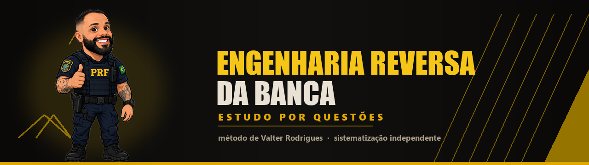
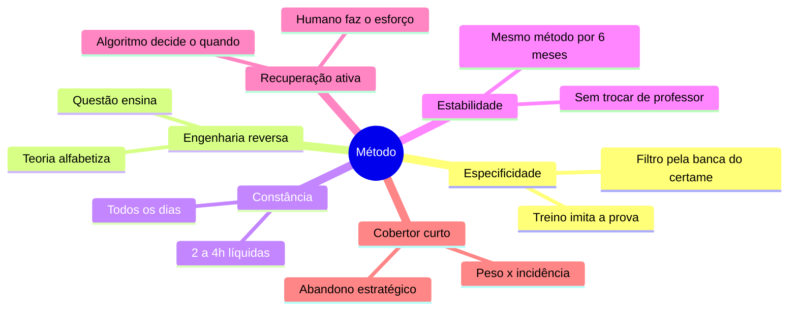
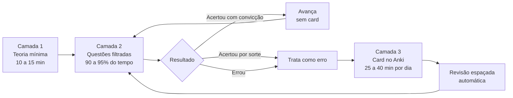
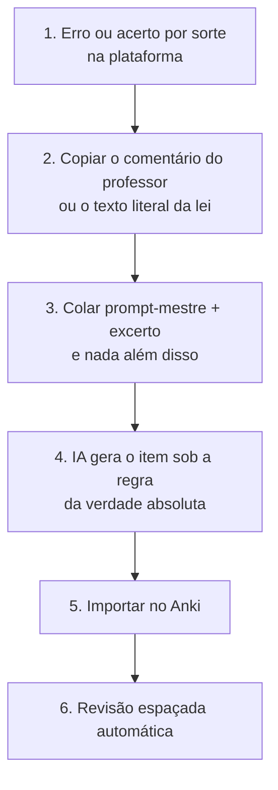

<div align="center">



# Engenharia reversa da banca

**O método de estudo por questões de Valter Rodrigues, sistematizado passo a passo, para qualquer área de concurso.**

[](https://www.youtube.com/@ValterRodrigues01)
[](https://www.youtube.com/@ValterRodrigues01)
[](LICENSE)

</div>

---

> [!IMPORTANT]
> O método descrito aqui é de autoria de [Valter Rodrigues](https://www.youtube.com/@ValterRodrigues01), policial civil, bacharel em Direito, primeiro colocado no concurso da Polícia Civil de Pernambuco.
>
> Este repositório é uma sistematização independente, feita a partir de conteúdo público do canal, sem vínculo, patrocínio, revisão ou endosso do autor. Não há transcrição de vídeo aqui: o texto é descritivo, e cada seção remete às [referências](#referências). Se o método te interessou, assista aos vídeos na fonte. É de lá que ele vem.

---

## Resumo

Este documento reconstrói, a partir de 63 fontes públicas, o protocolo de estudo que Valter Rodrigues defende para provas objetivas de concurso.

O método descarta o eixo tradicional de videoaula, resumo e revisão programada. No lugar, propõe um ciclo de três camadas: contato teórico curto, resolução de questões filtradas pela banca do certame, e conversão de cada erro em cartão de repetição espaçada.

O texto cobre a mecânica de leitura e correção da questão, o catálogo de pegadinhas de banca, a montagem de cadernos e filtros na plataforma, a leitura do ranking e das estatísticas, o desenho do cronograma em ciclo duplo, a configuração do Anki com o passo a passo de importação dos cartões, o fluxo de inteligência artificial das duas aulas sobre o tema, a transposição para carreiras fora da área policial, e um catálogo de erros comuns.

Palavras-chave: estudo por questões, engenharia reversa de banca, prática de recuperação, repetição espaçada, princípio da especificidade, Anki, FSRS, ciclo de estudos.

---

## Sumário

| # | Seção | O que resolve |
|---|---|---|
| 0 | [O método em uma página](#o-método-em-uma-página) | O artigo inteiro condensado, para consulta rápida |
| 1 | [O problema do estudo passivo](#1-o-problema-do-estudo-passivo) | Por que o eixo tradicional falha |
| 2 | [Corpus e método desta sistematização](#2-corpus-e-método-desta-sistematização) | De onde vem cada afirmação |
| 3 | [O autor do método](#3-o-autor-do-método) | Quem é e por que isso importa |
| 4 | [Os seis princípios](#4-os-seis-princípios) | A lógica por trás de cada regra prática |
| 5 | [O protocolo em três camadas](#5-o-protocolo-em-três-camadas) | O que fazer amanhã de manhã |
| 6 | [Como estudar a questão](#6-como-estudar-a-questão) | Leitura, pegadinhas, correção, refazimento |
| 7 | [Cadernos e filtros](#7-cadernos-e-filtros) | Como montar o material de treino |
| 8 | [Ranking e estatística](#8-ranking-e-estatística) | Como decidir o que estudar com dados |
| 9 | [Cronograma em ciclo duplo](#9-cronograma-em-ciclo-duplo) | Como distribuir o tempo |
| 10 | [Anki, do card à importação](#10-anki-do-card-à-importação) | Como o erro vira revisão automática |
| 11 | [Inteligência artificial aplicada](#11-inteligência-artificial-aplicada) | O fluxo das Aulas 01 e 02 |
| 12 | [Comportamento em simulado e prova](#12-comportamento-em-simulado-e-prova) | Ordem, tempo, chute, quando pular |
| 13 | [Transposição para outras áreas](#13-transposição-para-outras-áreas) | Policial, fiscal, tribunais, nível médio |
| 14 | [Erros comuns](#14-erros-comuns) | O que sabota a preparação |
| 15 | [Limitações](#15-limitações) | Onde o método não alcança |
| 16 | [Conclusão](#16-conclusão) | |
| | [Referências](#referências) | Os 52 vídeos, com link |

---

## O método em uma página

Quem não quiser ler as dezesseis seções pode começar por aqui. Isto é o artigo inteiro condensado, e cada bloco tem link para a parte que explica o porquê.

### O dia

1. Escolhe uma matéria do ciclo de elite e uma do ciclo de rodízio ([seção 9](#9-cronograma-em-ciclo-duplo)).
2. Assunto novo: dez a quinze minutos de resumo, só para aprender o vocabulário. Nada de videoaula longa ([5.1](#51-camada-1-o-primeiro-contato-com-um-assunto-novo)).
3. Vai para um bloco de 20 a 30 questões da banca do seu concurso, no seu nível de cargo ([5.2](#52-camada-2-a-resolução)).
4. Lê o comando antes do texto, grifa modal, advérbio de restrição, prazo e competência ([6.1](#61-a-ordem-de-leitura) e [6.2](#62-o-que-grifar)).
5. Acertou com convicção, segue. Errou ou chutou, gasta três minutos: gabarito, comentário do professor, literalidade da lei ([6.5](#65-o-minuto-a-minuto-depois-do-gabarito)).
6. Transforma o erro em um card e importa no Anki ([10.3](#103-adicionar-um-cartão-clique-a-clique) e [10.6](#106-importação-em-lote)).
7. Zera a fila de revisão no celular, fragmentada ao longo do dia, fora da contagem de horas ([10.7](#107-backlog)).

### Os números

| Item | Valor |
|---|---|
| Teoria por assunto novo | 10 a 15 min |
| Bloco de questões | 20 a 30 por assunto |
| Tempo por questão no treino | 1 a 2 min |
| Meta diária de questões | 30 a 50 |
| Critério para avançar de assunto | 80% a 85% de acerto |
| Horas líquidas por dia | 2 a 4, todos os dias |
| Correção de cada erro | 3 min |
| Card no Anki | 3 linhas na frente, 3 no verso, 16 a 20 s |
| Cards novos por dia | 25 a 30 |
| Tempo diário de Anki | 25 a 40 min, fragmentado |
| Retenção no FSRS | 90% padrão, 86% a 87% longo prazo, 94% reta final |
| Teto por caderno seriado | 20 questões |
| Recorte de anos no filtro | últimos 3 a 5 |
| Faixa do iniciante | questões com 85% a 90% de acerto geral |
| Onde a estatística começa a valer | a partir de 75% a 80% de acerto |
| Tempo mínimo no mesmo método | 6 meses |
| Tempo por item na prova | 2 a 3 min |

### As três regras que sustentam tudo

Especificidade: treine no formato exato da prova, filtrado pela banca do seu certame. Ler doutrina não é treino ([4.1](#41-especificidade)).

Acerto por sorte é erro: se você chutou e acertou, faça o card mesmo assim. É o que impede a sua estatística de mentir para você ([5.3](#53-o-protocolo-de-correção)).

Prioridade é peso vezes incidência: o que a disciplina vale no edital multiplicado pelo quanto a banca cobra aquele assunto. O resto se estuda por amostragem ou não se estuda ([8.3](#83-incidência-e-peso-do-edital)).

### O que o método manda cortar

Videoaula integral e PDF teórico de centenas de páginas. Resumo manuscrito colorido. Caderno de erros em papel ou planilha, porque o repositório de erro é o Anki ([6.6](#66-onde-o-erro-fica-registrado)). Calendário fixo de revisão em 24 horas, 7 dias e 30 dias, porque quem agenda é o algoritmo. Baralho de Anki pronto comprado de terceiros. Questão de 96% de erro, que não volta na sua prova ([8.1](#81-o-ranking-de-dificuldade)). Trocar de método a cada nota baixa ([14](#14-erros-comuns)).

### O canal

Tudo isso vem de [@ValterRodrigues01](https://www.youtube.com/@ValterRodrigues01). Os vídeos que dão a espinha dorsal do método são [Questões, Anki e NADA MAIS!](https://www.youtube.com/watch?v=B2hvxDneLms), [Vendo a matéria pela primeira vez e indo para as questões](https://www.youtube.com/watch?v=bZgatYEUUN0), [Especificidade](https://www.youtube.com/watch?v=Q132w-ZpE3E), [Por que mudei meu jeito de montar cadernos e fazer filtros](https://www.youtube.com/watch?v=XWkY1ChV57U) e as duas aulas de IA, [01](https://www.youtube.com/watch?v=P-cKMJOVySk) e [02](https://www.youtube.com/watch?v=76RLDpFWTxE). A lista completa está nas [referências](#referências).

---

## 1. O problema do estudo passivo

Quase todo candidato monta a preparação em cima de uma ideia que raramente examina: a de que primeiro se aprende a matéria e só depois se treina a prova. Dessa ideia saem a videoaula integral, o PDF de trezentas páginas, o resumo colorido feito à mão e o calendário de revisão em 24 horas, 7 dias e 30 dias.

O método parte da negação disso. A prova objetiva não mede domínio acadêmico de uma disciplina. Ela mede se você julga certo um enunciado escrito por uma banca específica, dentro de um recorte estreito de assuntos, com o relógio correndo. Se é isso que a prova mede, é isso que o treino tem que reproduzir. O resto é tempo que saiu de algum lugar.

A tese cabe em uma frase: a aprovação vem de engenharia reversa da banca somada a memorização espaçada e automatizada, não de aprofundamento acadêmico. Todo o resto deste documento é a operacionalização dessa frase.

---

## 2. Corpus e método desta sistematização

O material analisado são 63 fontes reunidas em um caderno de pesquisa: 60 vídeos publicados no canal de Valter Rodrigues, aproximadamente entre 2023 e 2026, mais três materiais de apoio (um documento de priorização por edital e dois arquivos de prompt).

As fontes foram interrogadas em onze blocos temáticos: identidade e princípios; protocolo de resolução; mecânica de leitura da questão e pegadinhas; montagem de cadernos e filtros; estatística e ranking; uso do Anki; importação de cartões; as duas aulas de inteligência artificial; cronograma e carga horária; erros comuns e adaptação por área; e a estrutura do prompt de geração de questões.

As respostas foram cruzadas entre si e reorganizadas nesta ordem. Quando o corpus dá um número explícito, ele aparece no texto. Quando um número resulta de síntese, isso está dito. A [seção 15](#15-limitações) discute o que esse desenho não alcança.

---

## 3. O autor do método

Valter Rodrigues é policial civil e bacharel em Direito. A credibilidade dele dentro do próprio corpus não vem de uma história de sucesso linear. Vem do contrário: as aprovações e as derrotas aparecem com o mesmo nível de detalhe.

| Certame | Resultado |
|---|---|
| Polícia Civil de Pernambuco | Primeiro colocado |
| Delegado, Polícia Civil de Alagoas | Ficou de fora por 1 ponto |
| Polícia Civil de Goiás | Desclassificado, o celular tocou dentro da sala |
| Polícia Penal do Distrito Federal | Estratégia documentada publicamente como inscrito |

O canal, [@ValterRodrigues01](https://www.youtube.com/@ValterRodrigues01), tem 91,5 mil inscritos e 160 vídeos publicados.

O tom do canal é deliberadamente antirromântico. Ele rejeita a estética do sofrimento, a rotina de quatro horas de sono, o banho gelado de madrugada e o marketing motivacional de cursinho. Trata o concurso como um problema de alocação com recurso escasso.

Isso tem consequência metodológica: quase toda recomendação do método se justifica por custo e benefício, não por virtude. Quando ele manda cortar um tópico do edital, o argumento nunca é "isso não é importante". É "isso custa vinte horas e vale um ponto".

> "Do concurso da guarda municipal ao topo da magistratura, a prova objetiva continua sendo o mesmo teste mecânico. A metodologia não pode mudar. Muda só o volume de dados."

---

## 4. Os seis princípios



### 4.1 Especificidade

É o eixo do método, emprestado da fisiologia do treinamento esportivo: o treino deve imitar as condições da competição. Nadador treina nadando. Goleiro treina defendendo. O concurseiro treina marcando gabarito de questão da banca do concurso dele.

Ler doutrina tem especificidade baixíssima. Resolver questão da banca tem especificidade máxima. Todo filtro que aparece na [seção 7](#7-cadernos-e-filtros) existe por causa desse princípio.

### 4.2 Engenharia reversa

A teoria não é o ponto de partida do aprendizado. Ela é alfabetização: serve para você adquirir o idioma da disciplina, saber o que significam as palavras que vão aparecer no enunciado. Depois disso, aprende-se a partir da questão. Enunciado, gabarito e comentário do professor formam a unidade elementar de estudo.

O pressuposto por trás disso é que a banca não tem criatividade ilimitada. Ela tem um banco de questões finito e recicla os mesmos padrões lógicos prova após prova. Quem resolve centenas de questões da mesma banca começa a enxergar de que artigo ela gosta, que conjunção de português ela prefere, que prazo ela troca de lugar. Estudar a questão é aprender o padrão de cobrança para antecipar o gabarito.

### 4.3 Constância acima de intensidade

De duas a quatro horas líquidas por dia, todos os dias do ano, incluindo feriado e Natal. O argumento é de sustentabilidade. Resolver questão concentrado é cognitivamente pesado, pesado o bastante para que dez horas diárias sejam ficção estatística: quem diz esse número quase sempre está somando tempo passivo.

### 4.4 Estabilidade metodológica

Trocar de método, professor ou cronograma a cada oscilação de rendimento destrói a curva de adaptação. O corpus recomenda seis meses no mesmo protocolo antes de julgá-lo. É o tempo que o cérebro leva para se adaptar e o tempo que suas estatísticas levam para ter amostra suficiente para significar alguma coisa.

### 4.5 Recuperação ativa automatizada

Calendário fixo de revisão (24 horas, 7 dias, 30 dias) revisa o que já está consolidado com a mesma frequência com que revisa o que está frágil. O método transfere a decisão de quando revisar para o algoritmo de repetição espaçada e deixa para o humano só o esforço de recuperar a informação.

### 4.6 Cobertor curto

O tempo é finito, o edital não. Em vez de cobertura homogênea, alocação proporcional ao retorno: peso da matéria na prova multiplicado pela incidência histórica do assunto naquela banca. Abandonar tópico de incidência baixíssima não é preguiça. É como se financia profundidade onde os pontos estão.

---

## 5. O protocolo em três camadas

A camada 1 alfabetiza, a camada 2 diagnostica, a camada 3 repara.



| Camada | Função | Tempo | Saída |
|---|---|---|---|
| 1. Contato teórico | Alfabetizar no vocabulário do assunto | 10 a 15 min por assunto | Familiaridade com os termos |
| 2. Questões | Diagnosticar lacunas e aprender o padrão da banca | 90 a 95% do tempo líquido | Lista de erros e acertos por sorte |
| 3. Anki | Reparar as lacunas e conter o esquecimento | 25 a 40 min fragmentados | Retenção de longo prazo |

### 5.1 Camada 1, o primeiro contato com um assunto novo

Leitura de um resumo objetivo, sinopse ou mapa mental, por dez a quinze minutos no máximo. Nessa fase é vedado assistir videoaula longa ou ler PDF teórico extenso.

O objetivo não é entender o tema em profundidade. É saber o que querem dizer as palavras que vão aparecer nos enunciados. Se você abrir um bloco de questões de improbidade sem saber o que é "agente público", vai errar por vocabulário, não por conteúdo. Os quinze minutos existem só para evitar isso.

### 5.2 Camada 2, a resolução

Terminados os quinze minutos, você vai direto para um bloco de 20 a 30 questões do assunto.

Iniciante absoluto filtra apenas as questões classificadas como muito fáceis, aquelas com 85% a 90% de acerto geral na base. A razão é comportamental antes de ser pedagógica: quem erra 80% do primeiro bloco abandona o método na primeira semana.

Três regras dentro do bloco:

Decida rápido, de um a dois minutos por questão. Não brigue com a questão: se não sabe, abra o gabarito e o comentário do professor sem culpa, porque no treino por engenharia reversa consultar é técnica, não fraude, e o objetivo do bloco é aprender como a banca cobra, não medir desempenho. E não leia debate de fórum, porque comentário longo de aluno e tentativa de redigir o comentário perfeito consomem tempo sem devolver ponto.

### 5.3 O protocolo de correção

É aqui que a questão deixa de ser exercício e vira material de estudo. O tratamento depende do resultado, e há três casos, não dois.

| Resultado | Tratamento |
|---|---|
| Acertou com convicção | Avança. Não lê comentário, não faz card. |
| Acertou por sorte ou chute | Trata exatamente como erro. É o ponto mais negligenciado do método: acerto casual é lacuna disfarçada de competência. |
| Errou | Isola o dispositivo de lei, a jurisprudência ou o conceito que causou o erro, identifica a pegadinha usada e gera o card. |

O corpus é insistente no caso do meio. Se você chutou entre duas alternativas e acertou, o gabarito diz que você acertou e a sua estatística sobe, mas nada no seu cérebro mudou. Na próxima vez o chute pode cair do outro lado. Tratar o acerto casual como erro é o que impede a estatística de mentir para você.

> [!TIP]
> Critério de avanço: consolidar 80% a 85% de acerto no bloco de questões fáceis e médias autoriza passar para o próximo tópico do edital. O assunto vencido não volta em revisão manual, fica por conta do algoritmo.
>
> Meta diária de referência: 30 a 50 questões, tipicamente 30 de uma matéria de alto peso e 20 de uma secundária.

---

## 6. Como estudar a questão

Esta é a seção mais operacional do documento. Tudo que vem antes justifica o que está aqui.

### 6.1 A ordem de leitura

Nunca comece pelo texto de apoio ou pelo caso hipotético. Leia primeiro o comando final, a pergunta em si, para saber o que você está procurando. Depois faça uma varredura dirigida no texto base atrás daquilo. Ler o enunciado inteiro antes de saber o que se pergunta é reler duas vezes.

### 6.2 O que grifar

Quatro categorias de palavra decidem a maioria dos gabaritos:

Os modais deônticos, "pode" e "deve", que separam faculdade de obrigação. Os advérbios de restrição e generalização, "apenas", "somente", "sempre", "nunca", "salvo", "inclusive". Os prazos, números e quóruns. E o sujeito ativo da ação, junto com a competência atribuída a ele.

Grifar essas quatro coisas em toda questão, por semanas, é o que treina o olho. Depois de algum tempo você para de grifar e continua enxergando.

### 6.3 Distratores

Distrator bom quase nunca é uma mentira. Ele costuma ser uma afirmação juridicamente verdadeira que simplesmente não responde ao que o comando perguntou. É por isso que ele engana: você lê, confere com o que sabe, bate, e marca.

O remédio é riscar fisicamente as alternativas que estão corretas mas fogem do tema exigido pelo comando. Isso limpa o campo visual e reduz a decisão final a duas opções, em vez de cinco.

### 6.4 O catálogo de pegadinhas

O corpus mapeia cinco distorções que a banca recicla:

**Inversão de conceito, ou deslocamento de instituto.** A banca descreve com perfeição as regras de um instituto usando o nome de outro parecido. Descreve a prisão temporária com os requisitos da preventiva, por exemplo. Tudo na frase é verdadeiro em algum lugar do ordenamento, só não naquele rótulo.

**Inversão de regra e exceção.** Trata a exceção legal como se fosse a regra geral, omitindo as ressalvas da norma. Enunciado curto e limpo, sem o "salvo" que muda tudo.

**Troca de modal.** Troca o "pode" pelo "deve", ou o contrário. Transforma faculdade em obrigação vinculante. É uma palavra de quatro letras decidindo o item.

**Enxerto elegante.** Acrescenta uma exigência de aparência garantista ou justa que a lei simplesmente não pede. Soa razoável, soa constitucional, e é falso. Esse é o mais traiçoeiro, porque o candidato bem intencionado concorda com o enxerto.

**Troca de sujeito ou de competência.** Inverte atribuições de autoridades. Coloca o delegado decretando prisão quando a competência é do juiz. Quem lê rápido vê os dois substantivos corretos na frase e não checa quem faz o quê.

Vale a pena marcar cada erro seu com o tipo de pegadinha que te pegou. Depois de uns dois meses você descobre que erra sempre pelos mesmos dois ou três tipos, e aí dá para treinar especificamente contra eles.

### 6.5 O minuto a minuto depois do gabarito

O corpus organiza a correção em três minutos, com ordem fixa.

Primeiro minuto, o gabarito. Olhe o resultado. Acertou com convicção absoluta, próxima questão. Errou ou acertou por chute, para tudo e abre os comentários.

Segundo minuto, a explicação causal. Leia o comentário do professor para entender o porquê do erro. Não a tese doutrinária, não o debate de alunos no fórum: o ponto que resolve aquele item.

Terceiro minuto, a fixação. Abra a lei seca ou o informativo correspondente e veja a literalidade do texto que foi violado. Esse trecho literal é o insumo do card, e é isso que você cola na IA ou digita no Anki, com a palavra que corrige o erro em caixa alta.

Três minutos por erro parece pouco e é proposital. O tempo que sobra vai para a próxima questão, que é onde está o próximo diagnóstico.

### 6.6 Onde o erro fica registrado

Em um lugar só: o Anki. O método é explícito contra caderno de erros manuscrito e contra planilha de controle. Erro que você reescreve num caderno morre lá, passivo, esperando uma revisão que você provavelmente não vai fazer. Erro que vira card atômico entra na engrenagem de repetição espaçada e volta sozinho, no intervalo em que está prestes a se apagar.

A única manutenção que sobra na plataforma de questões é limpar do caderno as questões que você acertou com convicção. O que resta ali é o seu caderno de erros, sem você ter digitado nada.

### 6.7 Refazer questões

Você não agenda refazimento. O Anki reapresenta o conceito que você errou nos intervalos corretos, e é o conceito que importa, não aquela questão específica.

A exceção é a reta final, quando rodar em lote o caderno já limpo (só o que você errou ou teve dúvida) funciona como revisão rápida. Fora disso, refazer questão que você já acertou é decorar gabarito.

---

## 7. Cadernos e filtros

O método é operacionalizado no TEC Concursos. A escolha se justifica por três coisas: granularidade dos filtros, qualidade dos comentários de professor e, principalmente, as ferramentas de análise estatística, sem as quais boa parte do que vem na [seção 8](#8-ranking-e-estatística) não funciona.

Registre-se que o corpus indica que a parceria comercial do autor com a plataforma foi encerrada de forma unilateral e que ele seguiu recomendando a plataforma depois disso. A recomendação é técnica.

### 7.1 Os filtros de base

Quatro exclusões obrigatórias, porque poluem ao mesmo tempo o treino e a estatística:

- Remover desatualizadas. Regra revogada ensina o errado.
- Remover anuladas. Sem gabarito confiável não há o que aprender.
- Remover as sem comentário de professor. Sem comentário não existe o protocolo da [seção 6.5](#65-o-minuto-a-minuto-depois-do-gabarito).
- Remover inéditas e adaptadas. Questão que a banca nunca aplicou mascara a incidência real.

Some a isso o recorte temporal de três a cinco anos, que captura a tendência recente da banca sem arrastar legislação revogada.

### 7.2 A montagem, passo a passo

1. Antes de estudar qualquer coisa, gere um caderno amplo da disciplina só para ler o relatório de incidência. Você quer saber qual percentual de cobrança cada tema do edital tem naquela banca. Esse caderno é instrumento de medição, não de estudo.
2. Crie uma pasta por disciplina, nomeada com disciplina e banca. Por exemplo, `Português FGV`.
3. Marque a árvore do edital, selecionando todos os tópicos previstos de uma vez, mas feche os sub-sub-tópicos. Ramificação profunda demais só suja o índice.
4. Gere cadernos em série com teto de 20 questões cada. O limite mantém rotatividade e evita a fadiga do bloco infinito. Nomeie por assunto e número: `Pontuação 01`, `Pontuação 02`.
5. Conforme avança, use a função de remover as questões acertadas. O caderno se transforma sozinho no seu caderno de erros.

### 7.3 A mudança de arquitetura

O corpus registra uma revisão que o próprio autor fez na prática dele, e ela vale ser entendida porque contraria o que muita gente ensina.

| | Modelo antigo | Modelo atual |
|---|---|---|
| Estrutura | Dezenas de cadernos pequenos, um por tópico | Um caderno único por matéria, com todos os tópicos do edital juntos |
| Ordem | Linear, tópico a tópico | Modo aleatório, só as não resolvidas |
| Alocação de tempo | Minutos distribuídos manualmente por tópico | A proporção emerge da própria amostra |

Quatro razões justificam a troca.

A primeira é custo de gestão: administrar "doze minutos deste tópico e nove daquele" é burocracia consumindo o tempo que deveria ir para a questão. A segunda é realismo, porque na prova as questões não vêm agrupadas por assunto e exigem salto de contexto o tempo todo. A terceira é a intercalação: sair de uma questão de atos administrativos e cair em serviços públicos força o cérebro a um esforço que fixa melhor, argumento que remete à literatura de prática intercalada popularizada por *Make It Stick*. A quarta é que a proporção se resolve sozinha, porque num caderno completo em modo aleatório um assunto que responde por 25% da cobrança histórica aparece em uma a cada quatro questões, sem planilha nenhuma.

### 7.4 Uma banca ou várias

| Disciplina | Regra de filtro | Por quê |
|---|---|---|
| Língua Portuguesa | Só a banca do concurso, sem exceção | Cada banca tem vício próprio de cobrança, principalmente em interpretação de texto. Misturar aqui destrói a especificidade. |
| Jurídicas e técnicas | Banca principal; se o acervo esgotar, ampliar para bancas grandes ou filtrar por área | Amostra insuficiente é pior do que ruído controlado |
| Nível do cargo | Filtrar pelo nível do seu cargo | Quem faz prova de agente ou escrivão não treina em questão de juiz, promotor ou delegado. O recorte de profundidade é outro. |

---

## 8. Ranking e estatística

Aqui o método deixa de ser opinião e passa a ser leitura de dados. Há dois tipos de estatística em jogo e confundir os dois custa caro.

### 8.1 O ranking de dificuldade

A classificação de dificuldade das questões (muito fácil, fácil, média, difícil, muito difícil) não é atribuída por um professor. Ela sai do percentual real de acerto de todos os usuários que já responderam àquele item. É um ranking coletivo de desempenho, e é isso que o torna útil: ele te diz onde a população inteira de concurseiros tropeça.

| Perfil | Faixa a filtrar | Objetivo |
|---|---|---|
| Iniciante absoluto | Muito fáceis, 85% a 90% de acerto geral | Construir base sem abandonar o método por frustração |
| Intermediário | Fáceis e médias | Consolidar o padrão de cobrança da banca |
| Avançado ou reta final | Todas, em modo aleatório | Simular a prova real |

> [!WARNING]
> Brigar com questão de 96% de erro é o desperdício mais sedutor da preparação, porque parece estudo avançado. São itens que cobram legislação estrangeira, filigrana doutrinária ou tese isolada, e eles não voltam na sua prova. Se errou uma dessas: aceite, leia o comentário rápido, gere o card se valer a pena, siga. Redigir comentário acadêmico em fórum para parecer superior não te dá ponto nenhum.

### 8.2 As estatísticas pessoais

Percentual de acerto com 40 questões respondidas não significa nada. Estatística pessoal só se lê com volume, e antes disso o remédio é sempre o mesmo: mais questão.

O ponto de virada é a faixa de 75% a 80%. Antes dela, a tela de estatísticas não te diz nada que você não saiba (você erra tudo). Depois dela, ela vira a principal ferramenta de decisão, porque mostra exatamente onde está o platô.

E a ação corretiva não é estudar mais, é redistribuir. Se uma disciplina estagnou, divida ela em duas frentes dentro do ciclo e trate cada uma como matéria autônoma. Direito Administrativo, por exemplo, vira "Teoria" (atos, poderes, organização) e "Legislação" (licitações, improbidade, processo administrativo). Se outra disciplina já está gabaritando, corte o tempo dela sem dó e financie a primeira.

### 8.3 Incidência e peso do edital

A prioridade de estudo é o produto de duas grandezas independentes:

> prioridade = peso da disciplina na prova × incidência histórica do assunto naquela banca

O peso vem do edital, de quantas questões cada disciplina vale. A incidência vem do relatório do caderno de medição da [seção 7.2](#72-a-montagem-passo-a-passo).

Uma disciplina de peso alto cujo conteúdo se concentra em três assuntos merece esses três assuntos até o fim, e o resto por amostragem. Vinte horas num microtema de 1% de incidência têm retorno perto de zero, e essas vinte horas vieram de outra matéria.

---

## 9. Cronograma em ciclo duplo

O método descarta a tabela semanal fixa, aquela de segunda português, terça penal. A diferença é operacional: numa tabela fixa, um imprevisto na terça faz você perder penal naquela semana. Num ciclo, você retoma de onde parou e nada se perde.

| Ciclo | Contém | Frequência |
|---|---|---|
| Elite | As disciplinas que concentram a maior pontuação da prova | Roda rápido, aparecem quase todo dia |
| Rodízio | As disciplinas de menor peso | Avançam em sequência, sem pressa |

A regra diária é simples: uma matéria do ciclo de elite e uma do ciclo de rodízio.

A revisão não ocupa turno nem sábado. Ela é diária, automatizada, e roda fora das horas líquidas.

> [!TIP]
> Distribuição de referência: teoria em 10 a 15 minutos por assunto novo; questões consumindo 90% a 95% do tempo líquido, em blocos de 20 a 30 por assunto, algo entre uma hora e meia e duas horas por disciplina; Anki em 25 a 40 minutos fragmentados ao longo do dia, fora da contagem de horas líquidas. Carga total de 2 a 4 horas líquidas por dia, todos os dias.

### 9.1 Quem estuda há anos e só bate na trave

Para o candidato parado na faixa de 75% a 80% há muito tempo, o corpus é categórico: o problema não é falta de teoria, e comprar mais um curso não resolve. O que falta é precisão em detalhe fático, ou seja, literalidade de lei, exceção obscura, prazo, quórum, fração.

A correção tem três movimentos. Abandonar de vez o PDF teórico e migrar para engenharia reversa em volume. Aplicar a técnica de "vermelhar a lei", que é destacar no código apenas os dispositivos que fundamentaram questões que você resolveu, e nada além disso. E apertar os parâmetros do Anki nas pilhas de erro crítico, como descrito na [seção 10.4](#104-configuração-do-anki).

---

## 10. Anki, do card à importação

A divisão de trabalho entre as duas ferramentas é limpa: a questão diagnostica, o Anki repara. A questão encontra a lacuna, o cartão espaçado veda a lacuna. O método sustenta que essas duas capacidades esgotam o que a prova objetiva cobra, e daí sai a fórmula "questões, Anki e nada mais".

### 10.1 O que vira card

| Vira card | Não vira card |
|---|---|
| Erro cometido em questão | Conceito óbvio ou já dominado com convicção |
| Acerto por sorte | Número de decreto, data de promulgação, dado formal |
| Exceção absurda da lei | Qualquer coisa que você acerta por intuição |
| Prazo, quórum, fração, número | Ementa longa, acórdão prolixo |
| Manchete esquematizada de jurisprudência recente | Baralho pronto comprado de terceiros |

A proibição do baralho pronto não é implicância. Confeccionar o próprio cartão obriga você a decidir o que é o núcleo do erro, e essa decisão é parte do aprendizado. Cartão de outra pessoa é a resposta sem a pergunta.

### 10.2 Anatomia do cartão

O formato padrão é certo ou errado, no estilo Cebraspe, mesmo quando a sua prova é de múltipla escolha. Julgar um item é muito mais rápido do que ler cinco alternativas, e velocidade importa quando você tem cem revisões na fila. Para literalidade de lei e números, o formato é omissão de palavras (cloze).

O cartão é atômico: um fato por cartão, frente com no máximo três linhas. O verso traz o gabarito seco, seguido de justificativa de até três linhas, com a expressão que mata a questão em caixa alta.

Em regra, um cartão por questão errada. Hiperatomizar incha o baralho e mata a rotina em duas semanas.

A velocidade-alvo é de 16 a 20 segundos por cartão. Se você está levando mais que isso, o cartão está longo demais e precisa ser quebrado ou cortado.

```
FRENTE
A perda em favor da União dos instrumentos e produtos do crime e a obrigação
de indenizar constituem efeito específico da condenação, dependendo de
motivação expressa na sentença.

VERSO
Errado. Cuidam-se de EFEITO GENÉRICO DA CONDENAÇÃO, não de efeito específico,
operando-se independentemente de motivação autônoma.
```

### 10.3 Adicionar um cartão, clique a clique

Para inserir um cartão avulso, logo depois de corrigir a questão:

1. Abra o Anki no computador e clique em **Adicionar**, ou aperte a tecla `A`.
2. No menu **Tipo de nota**, escolha **Básico** para os itens de certo ou errado. Escolha **Omissão de palavras** se o cartão usa a sintaxe `{{c1::palavra}}`.
3. No menu **Baralho**, escolha o subbaralho da disciplina.
4. Preencha frente e verso.
5. Antes de salvar, preencha o campo **Etiquetas**, no rodapé da janela.

Sobre as etiquetas, elas são o que permite montar baralho filtrado na reta final. Use etiquetas separadas por espaço, com uma estrutura que combine origem do erro e conteúdo. Por exemplo: `erro_tec_fgv direito_penal cpp_art158 cadeia_de_custodia`. Perto da prova, um baralho filtrado por `erro_tec_fgv` te devolve exatamente as suas falhas.

Os baralhos usam subbaralho aninhado, com o concurso como baralho-pai e as disciplinas como ramos: `PCPR 2026::Língua Portuguesa`, `PCPR 2026::Ciências Forenses`. Isso reduz o custo mental de trocar de contexto a cada cartão.

### 10.4 Configuração do Anki

| Parâmetro | Recomendação | Racional |
|---|---|---|
| Algoritmo | FSRS ativado, no lugar do SM-2 | Agendamento mais preciso, menos revisão redundante |
| Learning steps | Zeradas ou em branco | Acertou o cartão novo, ele vai direto para 1 dia. O resgate de amanhã exige esforço real |
| Novos por dia | 25 a 30, limite rígido | Estabiliza a rotina em torno de 90 a 112 revisões diárias, de 25 a 40 minutos |
| Retenção desejada | 90% padrão, 86% a 87% para longo prazo | Retenção menor alonga intervalos, reduz a carga diária e aumenta o esforço de resgate |
| Retenção desejada, exceção | 94% em pós-edital e em pilha de erro crítico ou jurisprudência | Aproxima o contato justamente onde você falha |
| Organização | Um baralho-pai do concurso, subbaralhos por disciplina | Menos salto de contexto por cartão |

### 10.5 Se o cartão tem HTML

Quando o cartão vem com formatação (cor no gabarito, faixa de marca-texto na justificativa), colar o código direto no campo faz o Anki exibir as tags como texto, do tipo `<span>...</span>`.

A solução é o editor de HTML do campo. Clique dentro do campo Frente e aperte `Ctrl + Shift + X`, ou clique no ícone de código no canto do campo. Abre uma caixa de texto para código puro: cole o HTML ali e aperte a mesma combinação para fechar. Repita no campo Verso. A formatação aparece renderizada.

### 10.6 Importação em lote

Resolver um bloco e acumular dez ou quinze erros é normal. Adicionar um por um é onde a rotina morre. A importação em lote resolve isso.

1. Abra um editor de texto simples.
2. Coloque um cartão por linha, com as colunas separadas pela tecla `TAB`: frente, tabulação, verso, tabulação, etiquetas.
3. Salve como `.txt` ou `.csv`, com codificação **UTF-8**. Sem isso os acentos quebram.
4. No Anki, vá em **Arquivo > Importar**, ou aperte `Ctrl + I`, e abra o arquivo.
5. Na janela de importação, escolha o tipo de nota e o baralho de destino.
6. Marque a caixa **Permitir HTML nos campos**. Sem isso a formatação vira texto visível.
7. Confira o mapeamento: campo 1 para Frente, campo 2 para Verso, campo 3 para Etiquetas.
8. Clique em **Importar**.

O Anki lê a tabulação e cria todos os cartões de uma vez.

### 10.7 Backlog

A regra é zerar a fila todos os dias. Quando a constância quebra e o acúmulo vira uma montanha, o procedimento é o seguinte: zere o limite de cartões novos, o que interrompe a entrada de matéria nova; dedique-se só a vencer o atrasado; e só então retome o ciclo normal. Fazer o contrário, entrar matéria nova com backlog aberto, é como o baralho morre de vez.

Uma observação de rotina: as revisões não devem entrar na contagem das horas líquidas de estudo. Elas são feitas fragmentadas ao longo do dia, no celular, em fila, transporte, esteira. Se você contabiliza revisão como estudo, você estuda menos e acha que estudou mais.

### 10.8 Tratamento por tipo de conteúdo

| Conteúdo | Formato | De onde sai o card |
|---|---|---|
| Lei seca | Omissão de palavras | Só os artigos vermelhados, os que caíram em questão e você errou |
| Jurisprudência | Certo ou errado, ou cloze | Só a manchete esquematizada, últimos três anos, em Constitucional, Penal e Processo Penal |
| Decoreba pura (listas, requisitos, fases) | Certo ou errado com pegadinha de omissão ou inversão | Treina o olho a detectar o erro do jeito que a banca monta |

---

## 11. Inteligência artificial aplicada

Duas aulas do corpus, [Usando IA para concursos do jeito certo 01](https://www.youtube.com/watch?v=P-cKMJOVySk) e [02](https://www.youtube.com/watch?v=76RLDpFWTxE), tratam a IA como ferramenta mecânica de execução, não como professor.

A delimitação negativa vem antes da positiva: a IA está proibida de resumir PDF teórico longo, de montar cronograma motivacional e de estudar no lugar do candidato.

### 11.1 O fluxo



O que se copia da plataforma é o comentário correto do professor, a justificativa oficial do gabarito ou o texto literal da lei ou da jurisprudência associada. Nunca o enunciado errado, nunca a alternativa falsa. Material errado na entrada produz cartão errado na saída, e cartão errado é pior do que cartão nenhum, porque você vai memorizar o erro com disciplina.

Cola-se esse trecho na conversa onde o prompt-mestre já está ativo, e pede-se o cartão.

### 11.2 O formato de saída em três camadas

O prompt entrega o resultado dividido em três blocos, cada um com uma função.

A primeira camada é texto corrido em markdown, com o tema, a assertiva de certo ou errado em até três linhas e o gabarito comentado com o trecho corretor destacado. Serve para você ler e validar antes de importar qualquer coisa.

A segunda camada é o bloco de HTML da frente, com as tags básicas, o tema geral num `<span>` e a afirmação a julgar.

A terceira camada é o bloco de HTML do verso, com o gabarito colorido, a justificativa curta sobre uma faixa de marca-texto âmbar (`background:#fde68a; color:#111827`), a linha do gatilho de interrogação elaborativa e um rodapé cinza discreto.

As camadas 2 e 3 vão para o Anki pelo editor de HTML descrito na [seção 10.5](#105-se-o-cartão-tem-html), ou para o arquivo de importação em lote da [seção 10.6](#106-importação-em-lote).

### 11.3 Como não estudar coisa errada

Três salvaguardas.

O material de entrada tem que ser validado: comentário de professor, lei seca atualizada de fonte oficial, jurisprudência de fonte confiável. O envio é em micro-lotes, fatiado por assunto, e não livro inteiro ou edital completo, porque contexto grande demais degrada a saída. E o prompt trava a IA na regra de que o excerto é a única fonte da verdade, proibindo trazer doutrina externa, corrigir o excerto ou presumi-lo falso. É essa trava que impede a alucinação de virar flashcard.

### 11.4 Mapeamento reverso de incidência

É a aplicação mais original do corpus, e a que muda o jogo para quem estuda legislação.

1. Exporte da plataforma um lote de questões reais, na ordem de até 200 itens históricos da banca sobre uma lei específica, em texto puro.
2. Anexe o texto literal da lei correspondente.
3. Peça o cruzamento. A IA aponta, artigo por artigo e inciso por inciso, quais dispositivos têm incidência alta, média ou nula na cobrança histórica, e onde a banca costuma trocar palavras para induzir ao erro.
4. Vermelhe só o que apareceu como alta incidência.

O que essa técnica faz é automatizar o princípio da especificidade. Em vez de estudar a lei inteira com peso uniforme, você estuda a lei na proporção em que ela é cobrada, e o resto você lê uma vez e deixa quieto.

### 11.5 O prompt de referência

O corpus contém um prompt-mestre de geração de questões no estilo Cebraspe, de autoria de Valter Rodrigues. A estrutura está reproduzida abaixo, com crédito, para análise metodológica.

```text
Atuar como examinador da banca CESPE/Cebraspe para elaborar questões de
julgamento (Certo ou Errado). Nível de dificuldade: 8/10.

PRINCÍPIO DA VERDADE ABSOLUTA (INVIOLÁVEL)
• O excerto enviado é a VERDADE ABSOLUTA. Jamais o questione, corrija ou
  presuma falso.
• A distorção para criar um item "Errado" ocorre apenas na formulação do
  item, nunca na interpretação do excerto base.

DIRETRIZES DE ELABORAÇÃO
1. Correspondência: 1 excerto = 1 item. Nunca fundir dois excertos.
2. Proporção: equilíbrio de 50% Certo / 50% Errado no lote inteiro.
3. Nível: linguagem técnica, pegadinhas sutis.
4. Substituição legal: se o excerto citar artigo, substitua o número pelo
   conteúdo normativo.
5. Concisão: item e gabarito com no máximo 3 linhas cada.
6. Cortes permitidos: suprimir trechos prolixos, desde que sem perda de
   informação relevante.
7. Sem metalinguagem: proibido "segundo o excerto" ou similares.
8. Sem citação desnecessária de julgados, temas ou súmulas.

FORMATAÇÃO OBRIGATÓRIA (TRAVADA)
JULGUE CERTO OU ERRADO
[item no estilo CESPE]
GABARITO: [Certo / Errado]. [justificativa direta, com O TRECHO QUE "MATA"
A QUESTÃO EM NEGRITO E CAIXA ALTA]

O QUE NÃO FAZER
• Gabarito na mesma linha do item.
• Fundir dois excertos.
• Interpretar o excerto como falso.
• Texto de introdução, conclusão, disclaimer ou pergunta de follow-up.
• Copiar literalmente o excerto no gabarito.
```

Cada bloco resolve um problema específico:

| Bloco | Função |
|---|---|
| Persona e nível 8/10 | Calibra o registro linguístico e impede itens ingênuos |
| Verdade absoluta | Blinda contra o conflito entre o excerto e a base genérica do modelo. É a trava antialucinação |
| 1 excerto = 1 item | Impõe a atomicidade que o cartão exige |
| Substituir o número do artigo pelo conteúdo | Obriga a decorar a substância da norma, não o número |
| Formatação travada | Torna a saída importável sem edição manual |
| Lista de proibições | Desliga os vícios conversacionais do assistente, como preâmbulo e oferta de continuação |
| Exemplo resolvido | Ensina, por demonstração, que o erro deve ser distorção sutil e verossímil, não absurdo evidente |

### 11.6 Prompt otimizado, reservado

> [!NOTE]
> Esta seção vai receber a versão refinada do prompt. Quando ela entrar, o documento passa a registrar três coisas: o que cada módulo novo acrescenta em relação ao prompt de referência acima, que falha observada na prática motivou o acréscimo, e o formato de saída esperado com o caminho de importação no Anki.

---

## 12. Comportamento em simulado e prova

O método também opina sobre o dia da prova, e a lógica continua sendo alocação.

**Ordem de resolução.** Comece pelas matérias de maior peso que exigem esforço analítico de interpretação, com a mente descansada. Depois vão as disciplinas de direito, de leitura mais rápida. Exatas ficam obrigatoriamente por último, porque drenam energia cognitiva e podem te desestruturar logo no início.

**Tempo por item.** Calcule dois a três minutos de média.

**Quando travar.** Não gaste mais de um minuto brigando. Faça um círculo grande no número da questão no caderno de provas, avance, e volte só se sobrar tempo.

**Chutar ou deixar em branco.** Em prova de múltipla escolha sem penalidade, nunca deixe em branco, o chute é obrigatório. Em prova de certo e errado com penalidade, se você estudou em alta intensidade, confie na intuição treinada. Deixe em branco apenas quando você não faz ideia nem dos termos do enunciado. Branco em excesso destrói a nota e te tira da linha de corte.

---

## 13. Transposição para outras áreas

A pergunta prática é se o método serve para quem não vai fazer prova policial. A resposta separa o que é invariante do que é ajuste.

Não muda, da guarda municipal à carreira jurídica: a prova objetiva continua sendo julgamento de item sob restrição de tempo; o ciclo continua sendo teoria mínima, questões e cartão espaçado; o filtro continua sendo pela banca do certame e pelo nível do cargo; e a prioridade continua sendo peso vezes incidência.

Muda o seguinte:

| Área | Ajuste |
|---|---|
| Policial | Concentração em Penal, Processo Penal e legislação especial. Jurisprudência recente pesa muito e lei seca literal é o campo de batalha |
| Fiscal e controle | Contabilidade, auditoria e TI entram no ciclo de elite. As disciplinas de cálculo pedem mais teoria na camada 1 do que os quinze minutos padrão |
| Tribunais | Códigos de processo dominam, com muito volume de literalidade processual, o que favorece o cloze |
| Administrativa e nível médio | Núcleo de português, RLM, informática e noções de direito. O caderno único em modo aleatório funciona bem pela homogeneidade do edital |
| Nível superior e carreiras jurídicas | Sobe a carga de jurisprudência sumulada e a exigência de discursiva. O método é o mesmo, o volume de dados é maior |

E muda conforme o seu estágio:

| | Iniciante absoluto | Avançado |
|---|---|---|
| Teoria | 10 a 15 min por assunto, resumo rápido | Abandonada, entra só sob demanda de erro |
| Cadernos | Fatiados por assunto, filtrados em muito fáceis | Caderno único da matéria, modo aleatório |
| Consulta ao gabarito | Imediata, sem culpa | Só depois de decidir |
| Estatística | Ignora percentuais, amostra pequena demais | Guia os micro-ciclos corretivos |

### 13.1 Disciplinas com tratamento próprio

**Direito Administrativo**, o pesadelo do iniciante, se divide em duas frentes no ciclo: teoria (atos, poderes, organização) e legislação (licitações, improbidade, processo administrativo). Tratar como matéria única é o que produz o platô.

**Jurisprudência** fica limitada a Constitucional, Penal e Processo Penal, últimos três anos. Só a manchete esquematizada vira cartão. Ementa longa e acórdão prolixo não entram.

**Redação e discursiva** se treinam em meio digital com o corretor automático desligado, para que os erros de grafia apareçam. O texto se monta sobre um esqueleto fixo, decorado antes, e a postura é técnica, ancorada em legalidade e direitos humanos, sem radicalismo pessoal.

**Lei seca** se estuda vermelhando: destaque só o que caiu em questão, e transforme em cloze os dispositivos destacados que você errou.

### 13.2 Concurso escada e conciliação

O concurso escada é recomendado. Um cargo intermediário garante estabilidade financeira, tira a pressão familiar e deixa você continuar estudando para o cargo-alvo com paz de espírito.

Conciliar dois editais ao mesmo tempo só funciona quando existe núcleo comum robusto, algo em torno de 75% de disciplinas coincidentes. Com bases programáticas distintas, o resultado costuma ser reprovação nas duas.

---

## 14. Erros comuns

| Erro | Antídoto |
|---|---|
| Pular de galho em galho, trocando de método a cada nota baixa | Seis meses no mesmo protocolo antes de julgá-lo |
| Tentar abraçar o mundo e esgotar o edital de forma homogênea | Cobertor curto: cortar o de baixo rendimento e concentrar no de maior peso |
| Fugir das questões para não ver estatística baixa | Bloco de muito fáceis com consulta imediata ao comentário. O ego não é variável do modelo |
| Paralisia por planejamento, mais tempo montando planilha do que resolvendo | Caderno único, a proporção emerge sozinha |
| Poluir a estatística com questões inéditas e adaptadas | Excluir inéditas de todo caderno de medição |
| Estudar o que já domina, por conforto | Remover os acertos do caderno. O que sobra é o que precisa de você |
| Trocar socos com a banca em fórum, redigindo comentário acadêmico | Ler o erro, gerar o card, seguir |
| Bizu e modismo de internet, dormir quatro horas, banho gelado | Bom senso e sono. O sono consolida a memória, e a rotina precisa durar anos |
| Cursinho como espinha dorsal | Cursinho serve no começo, para vocabulário de matéria nova e para a mecânica de exatas. Não serve como método de pós-edital |
| Contar as revisões do Anki como hora líquida de estudo | Revisão é fragmentada e roda fora da contagem |

---

## 15. Limitações

Convém ponderar quatro pontos antes de adotar o protocolo inteiro.

**A origem dos números.** As faixas apresentadas (20 a 30 questões por bloco, 25 a 30 cartões novos, 80% a 85% como critério de avanço, 2 a 4 horas líquidas) aparecem de forma consistente no corpus. Já as estimativas de prazo até a aprovação resultam de síntese e não devem ser lidas como medida empírica. Trate como ordem de grandeza.

**A dependência de plataforma.** O método pressupõe uma base de questões com estatística por item, filtro por banca e comentário de professor. Sem esses três recursos, as seções 7 e 8 perdem boa parte da eficácia. E isso tem custo mensal.

**As disciplinas de raciocínio.** A camada 1 de dez a quinze minutos foi desenhada para conteúdo declarativo. Matemática, estatística, RLM e programação exigem construção procedimental, e nelas esse teto tende a ser curto demais. O próprio corpus admite videoaula passo a passo nesses casos.

**As fases além da objetiva.** O protocolo é otimizado para a primeira fase. Discursiva, oral e prova de títulos exigem treino de produção, que resolver item não cobre.

> [!IMPORTANT]
> Este documento é uma leitura organizada de material público de terceiro. Divergência entre o que está aqui e o que o autor defende se resolve em favor da fonte original, linkada nas referências.

---

## 16. Conclusão

O método de Valter Rodrigues é uma decisão de alocação. Ele parte de um recurso escasso, a atenção diária de alguém que quase sempre também trabalha, e joga esse recurso nas três atividades que mais devolvem ponto: julgar item da banca certa, isolar com precisão a causa de cada erro, e devolver essa causa à memória no intervalo em que ela está prestes a se apagar.

O que torna o método transportável para qualquer área é a estrutura, não o conteúdo. As disciplinas mudam, os pesos mudam, a banca muda. O ciclo de diagnóstico e reparo continua igual, e continua igual o hábito de olhar os dados antes de decidir o que estudar amanhã.

Para quem hoje estuda muito e avança pouco, a mudança mais barata disponível não custa nada: inverter a ordem entre a teoria e a questão, e passar a tratar o erro como o insumo mais valioso da preparação.

---

## Referências

Todas as fontes primárias são vídeos públicos do canal [Valter Rodrigues](https://www.youtube.com/@ValterRodrigues01). O crédito pelo método é dele. Assista na fonte.

### Método, questões e engenharia reversa

1. [Vendo a matéria pela primeira vez e indo para as questões (NA PRÁTICA)](https://www.youtube.com/watch?v=bZgatYEUUN0)
2. [Por que o iniciante foge das questões?](https://www.youtube.com/watch?v=uyHWNc4HBYU)
3. [A melhor forma de um iniciante começar a estudar!!!](https://www.youtube.com/watch?v=ZS-i5HRuKQ0)
4. [Questões, Anki e NADA MAIS!](https://www.youtube.com/watch?v=B2hvxDneLms)
5. [Especificidade: o princípio que deve nortear TODOS os seus estudos!](https://www.youtube.com/watch?v=Q132w-ZpE3E)
6. [DECORAR A MATÉRIA: uma verdade inconveniente](https://www.youtube.com/watch?v=MV4rt90FkZU)
7. [Do concurso da GCM a Ministro do STF: a sua metodologia NÃO PODE MUDAR!](https://www.youtube.com/watch?v=krQLAsHnjko)

### Cadernos, filtros e estatística

8. [Como montar cadernos e estudar como um PROFISSIONAL](https://www.youtube.com/watch?v=ap2plKaq5Qk)
9. [Por que mudei meu jeito de montar cadernos e fazer filtros de questões?](https://www.youtube.com/watch?v=XWkY1ChV57U)

### Anki e memória

10. [Anki: eu tenho ARGUMENTOS pra te convencer a usar](https://www.youtube.com/watch?v=V6GlKBLRSW0)
11. [Como estudar JURISPRUDÊNCIA? O Guia Definitivo](https://www.youtube.com/watch?v=Bnk5sLV8gLY)

### Inteligência artificial

12. [Aula 01, usando IA para concursos do jeito certo!](https://www.youtube.com/watch?v=P-cKMJOVySk)
13. [Aula 02, usando IA para concursos do jeito certo (essa vai bugar)](https://www.youtube.com/watch?v=76RLDpFWTxE)

### Cronograma, constância e mentalidade

14. [Montando seu cronograma na prática (com bom senso)](https://www.youtube.com/watch?v=OIwssmiFRVw)
15. [Estudar pouco, mas estudar sempre!](https://www.youtube.com/watch?v=XxJDOYBty7w)
16. [Vou provar que estudar menos é melhor!](https://www.youtube.com/watch?v=I1fNHMmqShc)
17. [A mentalidade correta para manter a constância sempre!](https://www.youtube.com/watch?v=k1D35AWX0J4)
18. [Quanto tempo até você passar? (Uma estimativa realista)](https://www.youtube.com/watch?v=HZgmzpYZ0AE)
19. [Já estuda há um tempo e só bate na trave? Pega o bizu!!](https://www.youtube.com/watch?v=SBuokz_mNL4)
20. [Com qual mentalidade encarar a jornada da preparação??](https://www.youtube.com/watch?v=PDLi42KTfR4)
21. [A comparação com os outros e a sensação de "atraso" na vida](https://www.youtube.com/watch?v=Csdz6q2GNwU)
22. ["Sair da zona de conforto" é uma meia verdade!](https://www.youtube.com/watch?v=BeD_XHExAlQ)
23. [Eu desanimei de estudar no momento](https://www.youtube.com/watch?v=BD6AC6ZcJzY)
24. [Você é um fraco se desistir da jornada dos concursos??](https://www.youtube.com/watch?v=n6E8RkO-OYA)
25. [Estudar mudou minha vida](https://www.youtube.com/watch?v=A1orF7NNDuw)

### Erros comuns e escolhas estratégicas

26. [Pare de pular de galho em galho! Mudar de método não é a solução](https://www.youtube.com/watch?v=GrQrqCw28N4)
27. [Pare de tentar fazer tudo. Comece a fazer o que importa!](https://www.youtube.com/watch?v=BUIX92x0UAg)
28. [Não adianta tentar abraçar o mundo](https://www.youtube.com/watch?v=poFC8AqEqOo)
29. [Provavelmente você não precisa de um cursinho](https://www.youtube.com/watch?v=3vClL_Ij3mg)
30. [Sobre ouvir conselhos, bizus, dicas e etc.](https://www.youtube.com/watch?v=3JsRjOBv3do)
31. [Existe essa de "CONCURSO ESCADA"??](https://www.youtube.com/watch?v=Zf0lXKU3Lis)
32. [A pergunta de 1 milhão: dá pra conciliar PF e PRF??](https://www.youtube.com/watch?v=ZIa4iKR9NM8)
33. [Concurso público ainda é a melhor forma de mudar de vida!!!](https://www.youtube.com/watch?v=onvaIbCOtJc)
34. [Cenário de concursos 2023: o que fazer???](https://www.youtube.com/watch?v=PXeuRQ4nhIc)

### Disciplinas específicas

35. [Guia da sobrevivência no Direito Administrativo: o pesadelo do iniciante](https://www.youtube.com/watch?v=AB-zZVUhKpw)
36. [Redação: eu vou te ensinar a ficar brabo!!!](https://www.youtube.com/watch?v=U5igyMtIBb8)
37. [Polícia Penal-MG, como DOMINAR a Lei de Execução Penal?](https://www.youtube.com/watch?v=kgPD8JcJ4Mo)

### Trajetória, provas e estratégia de certame

38. [O que eu fiz para ser o primeiro colocado na PCPE?](https://www.youtube.com/watch?v=Vlrh8wrRCgU)
39. [Como me saí na prova de Delegado, PCAL](https://www.youtube.com/watch?v=LvkOQcG3hDU)
40. [Delegado-PCAL: não entrei por 1 ponto. Quais são as lições e o futuro?](https://www.youtube.com/watch?v=S4W9oLaKwQM)
41. [O que aconteceu comigo na prova da PCGO?](https://www.youtube.com/watch?v=K7fMEwRzSNU)
42. [Estou inscrito na Polícia Penal-DF! Qual será minha estratégia?](https://www.youtube.com/watch?v=aeP-N61a0r8)
43. [Polícia Penal-DF: qual a melhor estratégia para o momento?](https://www.youtube.com/watch?v=e_UWtEym5Lg)
44. [Uma mensagem a quem fez a Polícia Penal-DF](https://www.youtube.com/watch?v=4GLcOiNYM54)
45. [PMDF: estratégia matadora para a reta final](https://www.youtube.com/watch?v=5YHV1D_vCmk)
46. [Polícia Legislativa da Câmara: não tenha medo do edital!!](https://www.youtube.com/watch?v=acI58wZJpnM)
47. [Dossiê obrigatório PPGO: 1600 vagas, não vacile](https://www.youtube.com/watch?v=FgzzfRcDL_A)

### Outros

48. [Cafeína, Venvanse, Ritalina, Nicotina, Modafinil, L-tirosina... (minha experiência)](https://www.youtube.com/watch?v=NGC23n4LvuQ)
49. [Por que eu não consigo manter a constância aqui no canal??](https://www.youtube.com/watch?v=BYovPcD5-Cc)
50. [Por onde andei??](https://www.youtube.com/watch?v=fszZmxEouMw)
51. [Vamos bater um papo...](https://www.youtube.com/watch?v=zHmanlJ-gQg)
52. [Uma homenagem a meu pai](https://www.youtube.com/watch?v=liubcTwBR6U)

---

## Créditos e aviso

O método é de [Valter Rodrigues](https://www.youtube.com/@ValterRodrigues01). Todo o mérito metodológico é dele.

Este repositório é uma sistematização independente e não oficial, feita a partir de conteúdo público do canal, sem vínculo, patrocínio, revisão ou endosso do autor. Não há transcrição de vídeo, e o texto remete o leitor à fonte original.

O prompt reproduzido na [seção 11.5](#115-o-prompt-de-referência) é de autoria de Valter Rodrigues e está aqui com crédito, para análise metodológica. Mediante solicitação do autor, será removido.

Marcas e plataformas citadas (TEC Concursos, Anki, Cebraspe, FGV) pertencem aos respectivos titulares e são mencionadas de forma descritiva.

O texto deste repositório está sob [CC BY 4.0](LICENSE). Use, adapte e compartilhe, mantendo a atribuição a Valter Rodrigues como autor do método.
